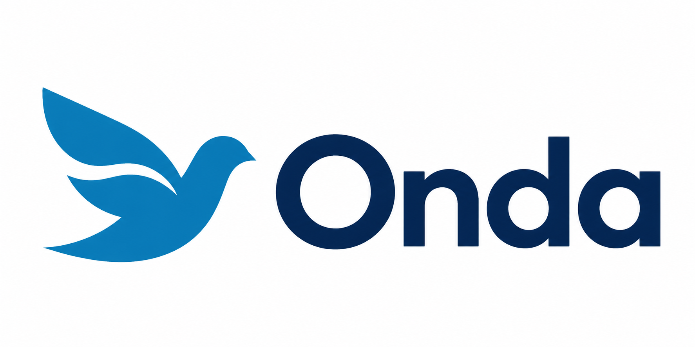
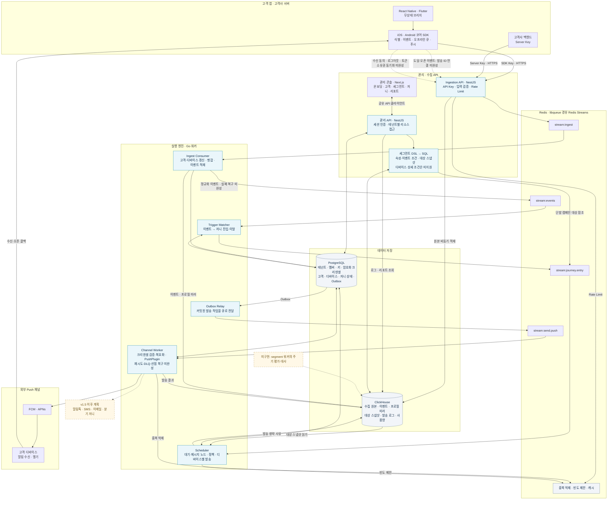

# Onda

<p align="center">
  <a href="https://github.com/ondahq/onda-platform/actions/workflows/ci.yml"></a>
  <a href="LICENSE"></a>
  
</p>

<p align="center">
  
</p>

**Open-source customer engagement.**
고객의 행동을 모으고, 대상을 고르고, 푸시 여정으로 연결합니다. 직접 설치할 수 있으며 관리형 SaaS는 준비 중입니다.

> ⚠️ 개발 중인 Push 중심 MVP입니다. 핵심 경로의 코드가 있으나 발송 복구·SDK 계약 연결·운영 검증이 남아 있습니다. 최근 수정 항목도 통합 검증이 필요합니다. API·스키마는 예고 없이 변경됩니다.

## 전체 아키텍처

고객 앱의 이벤트를 수집하고, 고객 조건과 저니에 따라 푸시를 발송합니다. 아래 그림은 **현재 코드의 구성과 연결**을 기준으로 하며, 운영 완료를 의미하지 않습니다.


<details>
<summary>상세 아키텍처와 데이터 흐름 (Mermaid)</summary>



</details>

- **실선**: 코드에 연결이 존재합니다. 실기기·장애 복구·부하 검증 통과를 뜻하지는 않습니다.
- **점선**: 아직 완성되지 않은 연결 또는 향후 구현 범위입니다. 현재 실제 채널 구현은 FCM/APNs Push입니다.
- **배포**: Docker Compose로 API·콘솔·워커와 PostgreSQL·ClickHouse·Redis를 구성합니다. 외부 DB 연결 설정과 Prometheus 지표도 포함하며, 관리형 DB 호환성과 백업 복구는 별도 검증이 필요합니다.
- **SDK**: 네이티브 코어가 상태를 관리하고 RN/Flutter는 이를 호출합니다. SDK 배포와 4개 플랫폼의 전체 연동 검증은 진행 중입니다.


## 현재 상태와 남은 작업

현재는 **Push MVP 알파**입니다. 출시 조건과 소스 근거는 [출시 체크리스트](docs-public/RELEASE-CHECKLIST.md)에 정리했습니다.

API 연동 방법과 전체 엔드포인트는 [API 가이드](docs-public/API.md)에서 확인할 수 있습니다.

- **발송 전 필수:** message_id 연결, 채널 재시도·DLQ·유실 복구, SDK 동의·로그아웃·토큰 소유권, 수집→저니 트리거 복구.
- **수정 반영·검증 대기:** 수집 dedup, pause, 권한, OS 권한 정규화 및 최근 설치·인증 변경.
- **공개·운영 준비:** 콘솔 API 주소 빌드 설정, SDK 패키지·실기기 검증, CI, 백업·부하·격리, 영문 문서와 관리형 서비스 운영.
- **기능 확장:** 디바이스 상세 필터, 세그먼트 정기 평가, 도달·오픈 리포트. 추가 채널과 분기 저니는 이후 계획입니다.

홍보 웹페이지는 상위 작업 공간의 `onda-webpage`에서 별도로 관리합니다. 영문·국문 페이지를 제공하며, 현재 Cloud 가입·결제는 열지 않습니다.

## 구조

```
apps/
  api/        NestJS — 관리 API + Ingestion API
  console/    Next.js — 어드민 콘솔
  worker/     Go — 실행 엔진 (--role: ingest-consumer|scheduler|trigger-matcher|segment|channel)
packages/
  openapi/         OpenAPI 3.1 스펙 + 공유 클라이언트 (자동 생성은 예정)
  queue-schemas/   큐 메시지 JSON Schema (단일 출처)
  libqueue-ts/     Redis Streams 래퍼 (TS, 생산)
  libqueue-go/     Redis Streams 래퍼 (Go, 생산·소비)
  segment-dsl/     세그먼트 DSL 스키마 + 골든 테스트
db/
  postgres/        Atlas 선언적 스키마
  clickhouse/      순번 SQL 마이그레이션
deploy/            Docker Compose
```

## 빠른 시작 (개발)

```bash
# 데이터 서비스만 (앱은 로컬 실행)
docker compose -f deploy/compose.yaml --profile full up -d
export ONDA_MASTER_KEY=$(openssl rand -base64 32)
go run ./apps/worker/cmd/migrate db        # 스키마 적용 (멱등)
pnpm install && pnpm build
pnpm --filter @onda/api dev                # 관리·Ingestion API :8080
go run ./apps/worker/cmd/worker --role=all # 워커 (전 역할)
pnpm --filter @onda/console dev            # 콘솔 :3000
```

## 셀프호스팅 (원-커맨드)

```bash
# Compose 전용 예제 사용 — 컨테이너 내부 주소(postgres/redis/clickhouse) 기준.
# 루트 .env.example은 호스트 로컬 실행용(localhost)이라 컨테이너에 주입하면 안 됩니다.
cp deploy/.env.example deploy/.env
echo "ONDA_MASTER_KEY=$(openssl rand -base64 32)" >> deploy/.env
docker compose -f deploy/compose.yaml --env-file deploy/.env --profile full --profile app up -d
# → 콘솔 :3000 · API :8080 · 워커 metrics :9090
```

자세한 배포·관리형 DB·백업·업그레이드는 [docs-public/DEPLOY.md](docs-public/DEPLOY.md).

## 운영 도구

```bash
go run ./apps/worker/cmd/seed --tenant <uuid> --app <uuid> --users 500000   # 합성 데이터
go run ./apps/worker/cmd/loadgen --key pk_... --rate 5000 --dur 30s          # 수집 부하
node tests/isolation/run.mjs                                                  # 테넌트 격리 검증
```

## 라이선스

별도 표시가 없는 Onda 플랫폼의 소스 코드와 문서는 [Apache License 2.0](LICENSE)으로 제공됩니다. Onda 이름·워드마크·로고와 `docs-public/assets/onda-logo-pigeon.png`는 Apache-2.0 허여 대상이 아닙니다.

범위와 재배포 안내는 [라이선싱 가이드](docs-public/LICENSING.md), 브랜드 사용 조건은 [상표 정책](TRADEMARKS.md), 제3자 구성요소 경계는 [제3자 고지](THIRD_PARTY_NOTICES.md)를 확인하세요.
