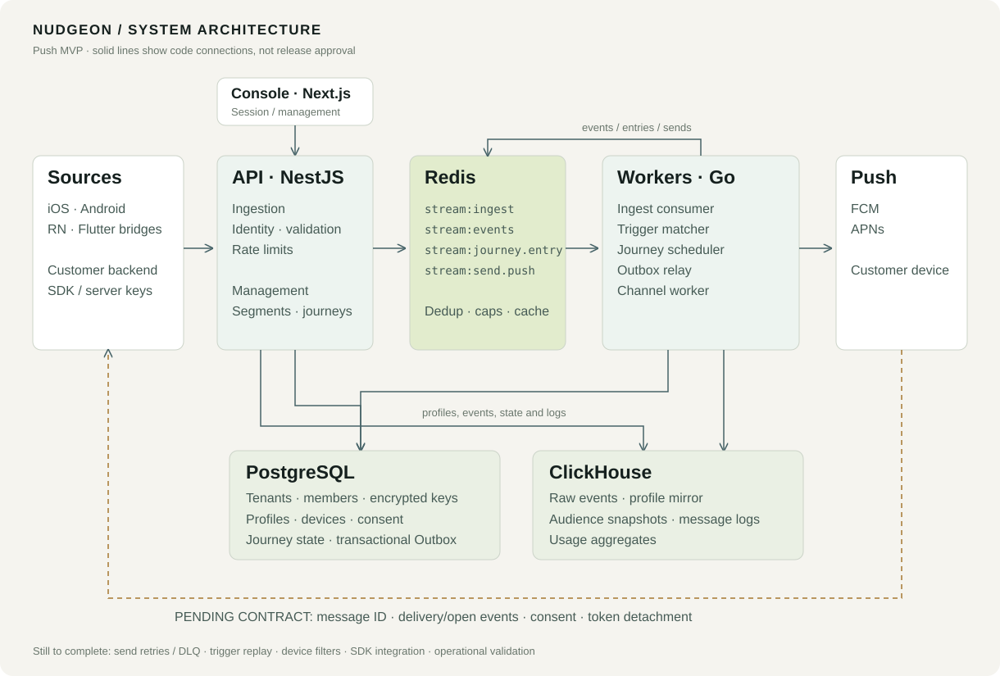
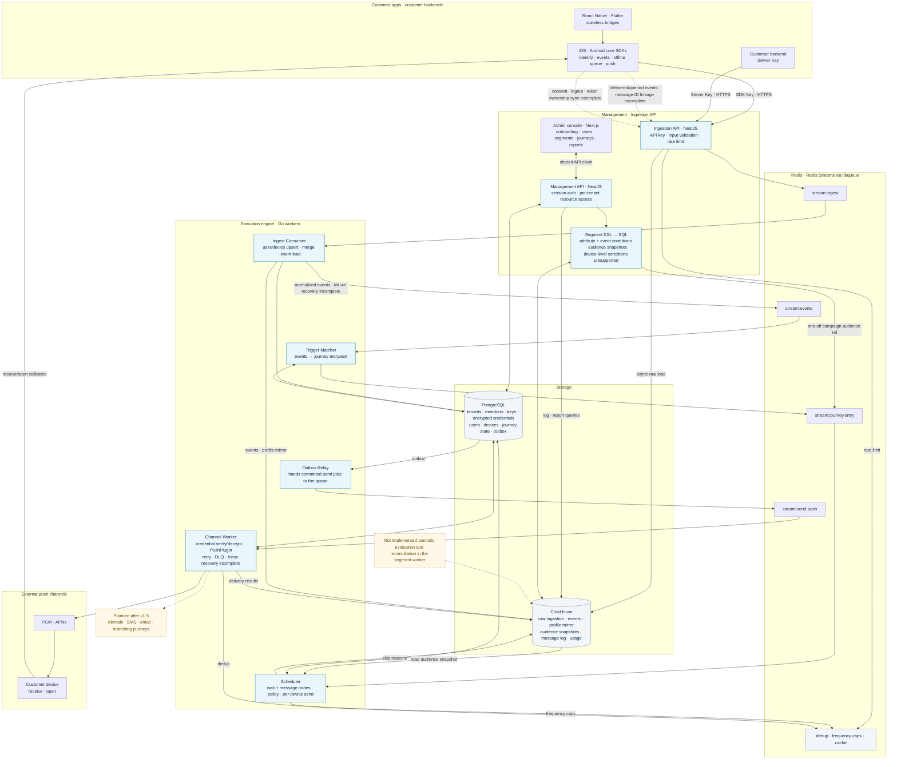

# NudgeOn

<p align="center">
  <a href="https://github.com/NudgeOn/nudgeon-platform/actions/workflows/ci.yml"></a>
  <a href="LICENSE"></a>
  
</p>

<p align="center">
  
</p>

<p align="center">
  <b>English</b> · <a href="README.ko.md">한국어</a>
</p>

**NudgeOn is an open-source customer engagement platform for product teams.**

Collect app events, build audiences, orchestrate journeys, and deliver mobile push from infrastructure you control. The platform source is available under Apache-2.0.

**Start locally with Safe Boot Preview.**
Run `./nudgeon up` to generate local secrets, start the runtime, and open the install-status screen. The first-Owner wizard and Test Inbox are still in development. A managed SaaS offering is also in preparation.

> ⚠️ NudgeOn is a push-focused MVP alpha. Event ingestion, audience rules, journey execution, and FCM/APNs delivery paths exist in source, but delivery recovery, SDK contract wiring, real-device and provider verification, and production operations remain unfinished. Recent fixes still need integration testing. APIs and schemas may change without notice.

## Current scope

- Event ingestion and user/device records
- Attribute- and event-based audience rules
- Event-triggered journeys with wait and message nodes
- Mobile push delivery paths for FCM and APNs
- Local self-hosting through Safe Boot Preview

## Architecture

NudgeOn ingests events from your apps and delivers messages according to audience rules and journeys. The diagram below reflects **what exists and is wired in the current source** — it does not imply production readiness.



<details>
<summary>Detailed architecture and data flow (Mermaid)</summary>



</details>

- **Solid lines**: the connection exists in source. It does not mean it has passed real-device, failure-recovery, or load testing.
- **Dashed lines**: connections that are unfinished or planned. The channels actually implemented today are FCM/APNs push and email (SMTP · AWS SES · Resend (SMTP/API + webhooks) · NHN Cloud).
- **Deployment**: Docker Compose brings up the API, console, and workers alongside PostgreSQL, ClickHouse, and Redis. External DB configuration and Prometheus metrics are included; managed-DB compatibility and backup/restore need separate verification.
- **SDKs**: the native cores hold state and the RN/Flutter bridges call into them. SDK publishing and full four-platform integration testing are in progress.

### Runtime at a glance

If the diagram above is the full wiring, the one below keeps only **the main path a single push travels and the trust boundaries it crosses**. The remaining streams and rules are written on the cards inside the image.


- **Main path**: SDK → Ingestion API → `stream:ingest` → Ingest Consumer → `stream:events` → Trigger Matcher → `stream:journey.entry` → Journey Scheduler → `stream:send.push` → Channel Worker → FCM · APNs
- **Trust boundaries**: external (customer apps and backends) / auth edge (`pk_` SDK Key · `sk_` Server Key · session cookie) / internal plane (private network, no per-request auth) / external channel-vendor egress
- **Interactive version**: [`docs-public/architecture/runtime-architecture.html`](docs-public/architecture/runtime-architecture.html) — open the file in a browser for search, path tracing, dark mode, and PNG/SVG export. The shape definitions live in `runtime-architecture.json` in the same folder.

## Current status

NudgeOn is a **Push MVP alpha**. Release gates and their source-level evidence are tracked in the [release checklist](docs-public/RELEASE-CHECKLIST.md).

For integration details and the full endpoint list, see the [API guide](docs-public/API.md).

The console screens are documented with real screenshots in the [console guide](docs-public/CONSOLE-GUIDE.md). Email supports SMTP, AWS SES, NHN Cloud, and Resend; Resend additionally collects delivered, opened, and clicked events via webhooks ([Resend setup guide](docs-public/RESEND-SETUP.md)).

- **Required before real sends**: message_id linkage; channel retry, DLQ, and loss recovery; SDK consent, logout, and token ownership; ingestion→journey trigger recovery.
- **Fixed, pending verification**: ingestion dedup, pause, permissions, OS-permission normalization, and recent install/auth changes.
- **Public launch and operations**: console API-URL build configuration, SDK packaging and real-device verification, CI, backup/load/isolation testing, and managed-service operations.
- **Feature expansion**: device-level filters, scheduled segment evaluation, delivered/opened reporting. Additional channels and branching journeys come later.

## Repository layout

```
apps/
  api/        NestJS — Management API + Ingestion API
  console/    Next.js — admin console
  worker/     Go — execution engine (--role: ingest-consumer|scheduler|trigger-matcher|segment|channel)
packages/
  openapi/         OpenAPI 3.1 spec + shared client (generation planned)
  queue-schemas/   JSON Schema for queue messages (single source of truth)
  libqueue-ts/     Redis Streams wrapper (TS, produce)
  libqueue-go/     Redis Streams wrapper (Go, produce and consume)
  segment-dsl/     Segment DSL schema + golden tests
db/
  postgres/        Atlas declarative schema
  clickhouse/      Sequential SQL migrations
deploy/            Docker Compose
```

The SDKs live in sibling repositories: [iOS](https://github.com/NudgeOn/nudgeon-ios-sdk) · [Android](https://github.com/NudgeOn/nudgeon-android-sdk) · [React Native](https://github.com/NudgeOn/nudgeon-rn-sdk) · [Flutter](https://github.com/NudgeOn/nudgeon-flutter-sdk)

## Quick start (development)

```bash
# Data services only (run the apps locally)
docker compose -f deploy/compose.yaml --profile full up -d
export NUDGEON_MASTER_KEY=$(openssl rand -base64 32)
go run ./apps/worker/cmd/migrate db           # apply schema (idempotent)
pnpm install && pnpm build
pnpm --filter @nudgeon/api dev                # Management + Ingestion API :8080
go run ./apps/worker/cmd/worker --role=all    # worker (all roles)
pnpm --filter @nudgeon/console dev            # console :3000
```

## Self-hosting — Safe Boot Preview

```bash
# Start Docker Engine / Compose v2, then run from the repository root.
./nudgeon up

# Re-check containers and the redacted install status.
./nudgeon status
```

Safe Boot generates local secrets without you writing a `.env`, boots a stack with no development seed data, and shows the readiness of PostgreSQL, Redis, ClickHouse, the API, the worker, and the console at `http://localhost:8080/setup`. Databases and internal services are not exposed on the host — only a single gateway binds to `127.0.0.1`. If port 8080 is already in use, override it: `NUDGEON_PORT=18080 ./nudgeon up`.

The current Preview is **Slice A**, which builds the repository source locally. Install-ownership claim, first-Owner creation, Test Inbox, versioned release images, and clean-host launch evidence are not included yet, so the Owner button on the setup screen is disabled. Do not present this as a remote public install or a production-ready path.

For commands, the manual development Compose file, managed databases, backup, and upgrades, see the [deployment guide](docs-public/DEPLOY.md). The full wizard goals and implementation boundaries are in the [P0 Docker Setup Wizard PRD](docs-public/DOCKER-SETUP-WIZARD-PRD.md), and launch evidence is in the [release checklist](docs-public/RELEASE-CHECKLIST.md).

## Operations tooling

```bash
go run ./apps/worker/cmd/seed --tenant <uuid> --app <uuid> --users 500000   # synthetic data
go run ./apps/worker/cmd/loadgen --key pk_... --rate 200 --dur 30s --concurrency 128 --max-p99 500ms  # ingestion load
node tests/isolation/run.mjs                                                 # tenant isolation checks
```

`loadgen` treats generator queue drops, non-202 responses, network errors, target-rate shortfall, and an optional end-to-end p99 limit as independent release gates. It prints a `run_id` in every request so PostgreSQL receipts/projections and ClickHouse events can be reconciled after the run. Size concurrency for the target latency and confirm generator drops stay at zero before attributing a failure to the API.

## License

Unless otherwise marked, the NudgeOn platform source and documentation are provided under the [Apache License 2.0](LICENSE). The NudgeOn name, wordmark, and logo — including `docs-public/assets/nudgeon-logo.png` — are not covered by the Apache-2.0 grant.

For scope and redistribution guidance see the [licensing guide](docs-public/LICENSING.md), for brand usage see the [trademark policy](TRADEMARKS.md), and for third-party component boundaries see the [third-party notices](THIRD_PARTY_NOTICES.md).
