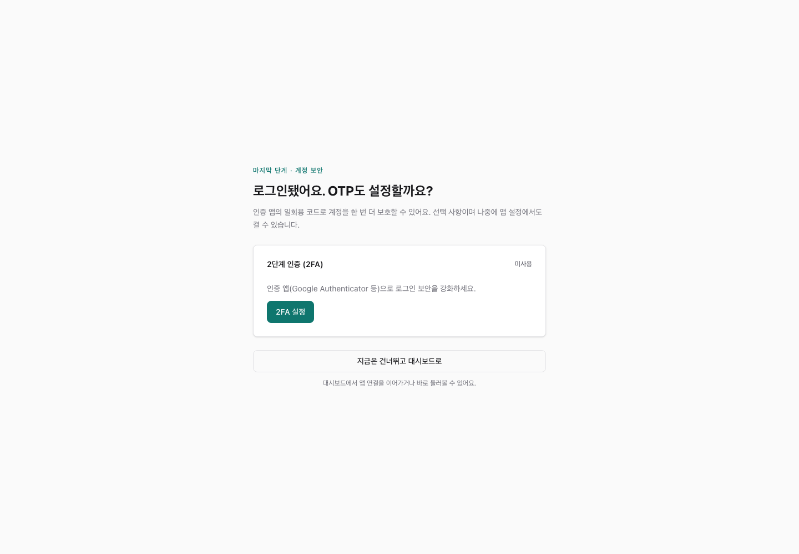
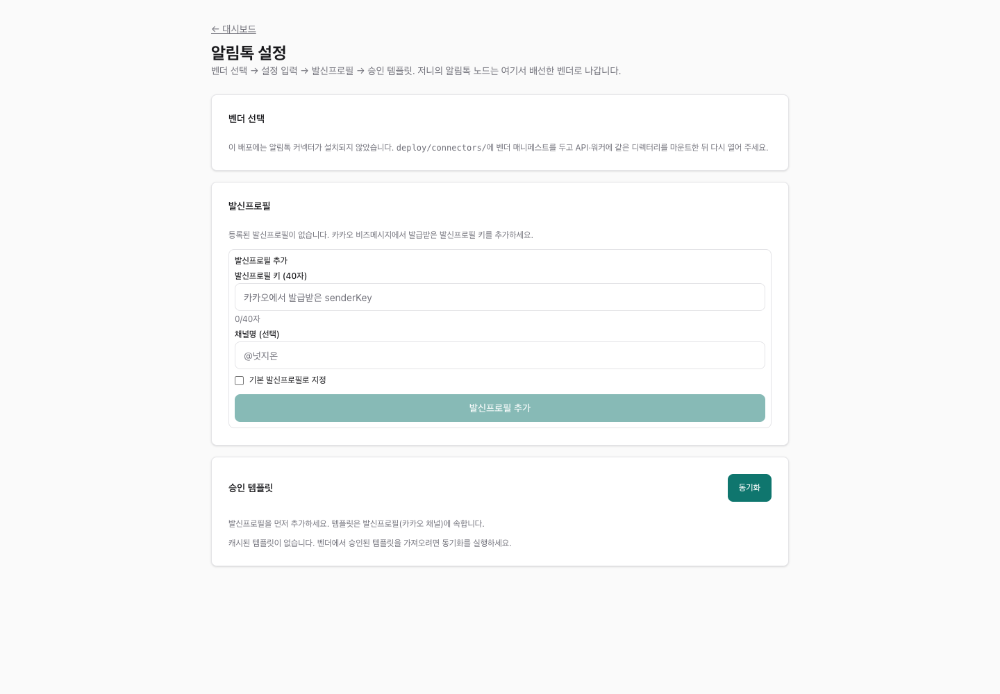

# NudgeOn 콘솔 화면 안내

2026-09-17 기준 NudgeOn 콘솔 안내입니다. 캡처는 현재 콘솔 코드를 실행하고 API 응답을 예시 데이터로 대체해 만들었습니다. 계정·고객·발송 수치는 설명용이며, 캡처 과정에서 실제 메시지를 보내지 않았습니다. 설치된 버전과 권한에 따라 보이는 메뉴가 다를 수 있습니다.

전체 화면 목록: [`assets/console/`](assets/console/)

---

## 1. 시작하기

### 언어 (ko / en)

콘솔은 브라우저의 `Accept-Language`로 첫 언어를 정하고(영어 브라우저면 영어), 대시보드 우상단의 언어 선택으로 바꿀 수 있습니다(쿠키 `NEXT_LOCALE`, URL은 그대로). 콘솔의 모든 화면(로그인·가입·대시보드·온보딩·저니 편집기·리포트·세그먼트·이메일 템플릿·알림톡 채널·설정·팀·로그·유저·감사·데이터)이 두 언어를 지원합니다. 카탈로그는 `apps/console/src/messages/{ko,en}.json` — ko가 권위이고, en에 빠진 키는 테스트가 막습니다. 영어 화면에서도 한국어로 남는 것은 서버가 주는 데이터뿐입니다: 알림톡 커넥터 매니페스트(`deploy/connectors/*.json`)의 표시 이름·설명·필드 라벨, 그리고 사용자가 입력한 이름들. 저니 검증 오류 메시지 중 서버(`packages/journey-model`)가 만드는 것도 한국어입니다.

### 처음 설치하기 — DB 설정부터 로그인까지

셀프호스팅은 `./nudgeon up`을 실행하고 터미널에 표시된 설치 링크를 엽니다. 현재는 NudgeOn 소스를 Docker 안에서 빌드하는 방식입니다. 필요한 도구와 원격 서버 접속 방법은 [배포 가이드](DEPLOY.md)를 확인하세요.

1. **DB 비밀번호 설정:** 직접 입력하거나 추천 비밀번호를 자동 생성합니다. **비밀번호 파일 다운로드**로 보관할 수 있습니다. 이 파일에는 평문 비밀번호가 포함됩니다.
2. **서비스 준비:** 비밀번호를 저장하면 필요한 서비스가 시작됩니다. 터미널을 열어 둔 채 위자드에서 준비 상태를 확인하세요. 이 단계는 최초 설치용이며, 기존 DB 비밀번호를 바꾸는 기능은 아닙니다.
3. **관리자 계정 만들기:** 설치 코드가 포함된 링크로 소유권을 확인한 뒤 워크스페이스·첫 앱·관리자 이름·이메일·로그인 비밀번호를 설정합니다. DB 비밀번호와 로그인 비밀번호는 별개입니다.
4. **첫 로그인:** 완료 화면의 **만든 계정으로 로그인하기**를 눌러 방금 만든 관리자 계정으로 접속합니다.
5. **OTP 설정 또는 건너뛰기:** 인증 앱의 6자리 코드로 OTP를 활성화하고 백업 코드를 보관하거나, **지금은 건너뛰고 대시보드로**를 선택합니다. 나중에 앱 설정에서 켤 수 있습니다. 조직에서 2FA를 필수로 설정한 경우에는 등록을 마쳐야 합니다.

설치 완료 화면의 SDK Key와 Server Key는 **한 번만** 표시됩니다. SDK Key를 잃어버렸다면 온보딩 1단계의 **SDK Key 회전**으로 새 키를 발급합니다. Server Key는 관리 API에서 별도로 관리합니다. SDK Key 회전이 Server Key까지 바꾸지는 않습니다.

최초 설정이 완료되면 설치용 계정 생성이 종료됩니다. 콘솔 사용을 차단한다는 뜻이 아니며, 이후에는 만든 관리자 계정으로 로그인합니다. Safe Boot의 `MODE=single_tenant`에서는 공개 가입을 제공하지 않습니다. `MODE=multi_tenant`에서는 가입할 때 새 테넌트를 만듭니다.

| 첫 관리자 로그인 | 다중 테넌트 모드의 가입 화면 |
|---|---|
|  |  |

### 대시보드

오늘 발송·실패·생략, 활성 저니, DAU/MAU, 앱 삭제율, 30일 발송량을 한 화면에서 봅니다. 아래 바로가기로 각 화면에 들어갑니다.

### 앱 연결 온보딩 — 4단계

대시보드의 **온보딩 위저드 열기**에서 앱 연결을 진행합니다. 서버 설치 위자드와는 별도의 과정입니다.

1. **SDK Key 확인:** 처음 발급받은 키를 사용합니다. 화면에는 키의 앞부분만 표시되며, 필요하면 새 SDK Key로 회전할 수 있습니다.
2. **채널 크리덴셜 등록:** Android는 FCM, iOS는 APNs 설정을 입력하고 검증 상태를 확인합니다.
3. **첫 이벤트 수신 확인:** iOS·Android·React Native·Flutter 예제와 `curl`을 제공합니다. 첫 이벤트가 들어올 때까지 5초마다 확인합니다.
4. **테스트 발송:** 고객 ID로 등록 기기를 조회하고, 발송 가능한 기기 한 대를 선택합니다. 발송 내용을 확인한 뒤 테스트를 요청하고 실제 기기에서 수신 여부를 확인합니다.

상단과 하단의 **지금은 건너뛰기**로 대시보드에 돌아갈 수 있습니다. 이미 저장한 설정은 유지됩니다. 푸시 발송에는 SDK 연결·FCM/APNs 설정·푸시 토큰과 알림 권한이 갖춰진 테스트 기기가 필요합니다.

최근 테스트 이력은 서버에 저장되며, 각 테스트에서 발송 기록과 실패 기록으로 이동할 수 있습니다. 응답이 유실됐다면 **같은 요청 다시 확인**을 사용합니다. 이 동작은 기존 접수 결과를 확인하며, 실패한 알림을 새로 보내는 기능은 아닙니다. 새로고침 후에는 최근 이력에서 결과를 확인하세요.

> 최초 설치·관리자 로그인·선택형 OTP와 앱 연결 온보딩은 구현되어 있습니다. Test Inbox와 전체 활성화 과정의 서버 저장형 재개는 후속 목표입니다. [설치 위자드 설계와 구현 범위](DOCKER-SETUP-WIZARD-PRD.md)를 참고하세요.

---

## 2. 고객 데이터

### 세그먼트

조건 그룹을 AND/OR로 묶어 대상을 정의하고, 저장 전에 예상 대상 수와 표본 고객을 확인합니다. 화면에서 추가할 수 있는 조건은 속성·행동(이벤트)·푸시 수신 상태 세 종류입니다. 예상 대상 수가 실제 발송 수를 보장하지는 않으며, 발송 시점의 수신 가능 상태와 발송 정책은 별도로 적용됩니다.

| 목록 | 편집 · 미리보기 |
|---|---|
|  |  |

새로 만들 때도 같은 빌더를 씁니다.

### 유저 검색 · 데이터

고객 식별자(`external_id`) 또는 이메일을 정확히 입력해 고객을 찾고, 프로필·디바이스·최근 이벤트를 봅니다. 데이터 화면에서는 수집된 속성 사전과 수집 오류를 확인합니다.

| 유저 검색 | 데이터 |
|---|---|
|  |  |

---

## 3. 캠페인 · 저니

### 인앱 웹 팝업 (개발 브랜치)

대시보드의 **인앱 이벤트**에서 HTML/ZIP을 NudgeOn에 저장하고 편집·미리보기·기기 테스트를 진행합니다. **캠페인 관리**에서는 같은 소스 버전의 OS별 검수를 승인한 뒤 기간, 화면/이벤트 트리거, 설치 기기별 표시 제한을 설정하고 게시합니다. 게시 중인 캠페인은 중지한 뒤 수정하며, 저장하지 않은 변경이 있으면 게시할 수 없습니다.

운영 노출·참여·닫힘과 실패 기록은 테스트 이력과 분리됩니다. 서버 기능 플래그와 신규 DB migration, 앱의 인앱 SDK 모듈 연결이 필요합니다. 기존 공개 SDK 태그에는 아직 포함되지 않았습니다. [작업실 안내](IN-APP-WORKBENCH.md)와 [캠페인 게시·SDK 연결](IN-APP-CAMPAIGNS.md)을 참조하세요.

### 저니 편집기

세그먼트 또는 이벤트를 진입 조건으로 정하고, 시간 대기·메시지·이벤트 대기·분기·A/B 분할을 연결합니다. 신규 고객 환영·재방문 유도·서비스 업데이트 템플릿으로 시작할 수도 있습니다. 그래프 편집과 시작 템플릿은 서버에서 그래프 기능을 활성화한 경우 제공됩니다. Safe Boot는 기본적으로 `JOURNEY_GRAPH_V2_ENABLED=false`이므로 아래 캡처와 다를 수 있습니다.

메시지 단계에서는 푸시·이메일·알림톡을 설정합니다. 이메일은 SMTP·NHN Cloud·Resend 발송기를 선택할 수 있고, 알림톡은 연결된 발신프로필과 승인된 템플릿이 필요합니다. 지원 범위는 배포된 서버·커넥터 설정에 따릅니다.

**먼저 테스트하고, 메시지를 발송해 보세요.** 초안을 저장한 뒤 **검증 후 활성화**에서 오류와 발송 대상을 확인합니다. 활성화는 실제 발송으로 이어질 수 있습니다. 세그먼트 진입은 테스트 대상만 포함한 세그먼트를, 이벤트 진입은 별도의 테스트 앱과 테스트 전용 이벤트를 사용하세요. 활성 저니를 수정할 때는 일시중지 후 편집합니다. 이미 진입한 고객은 기존 버전을 유지하고, 일시중지 중에도 대기 기한은 흐릅니다.

| 목록 | 편집기 |
|---|---|
|  |  |

### 저니 리포트

버전을 선택해 실행 수·대기·완료·발송 접수와 단계별·경로별 결과를 봅니다. 캔버스에서 단계를 선택하면 상세 집계를 확인할 수 있습니다. **도달·반응** 패널은 SDK 이벤트와 공급자 웹훅을 바탕으로 도달률·오픈률·클릭·반송을 보여줍니다. 아직 활성화하지 않았거나 단계별 계측을 지원하지 않는 버전은 화면에 그 상태를 표시합니다.

> 발송 접수는 전송 서비스가 받은 건수이고 실제 도달과 다릅니다. 도달·오픈은 SDK(`$push_delivered`/`$push_opened`)와 이메일 공급자 웹훅에서 옵니다.

---

## 4. 메시지 · 이메일

### 메시지 로그

대시보드의 **메시지 로그**에서 발송 기록을 확인합니다. **전체·공급자 접수·실패·건너뜀** 상태와 저니로 필터링하고, 조회된 최근 최대 200개 기록 안에서 메시지·고객 ID와 실패 원인을 검색할 수 있습니다. 상단 최근 1시간 집계는 필터와 관계없이 앱 전체 처리 기록을 나타냅니다.

기록을 펼치면 실패 상세, 메시지 ID 복사, 고객·디바이스와 저니 리포트 바로가기가 보입니다. 수신 불가·야간 제한·빈도 제한·유효 시간 초과마다 확인할 내용을 안내합니다. 필요하면 15초 자동 새로고침을 켜세요.

온보딩에서 테스트 발송을 요청한 뒤 **이번 테스트 발송 기록 보기**를 누르면 해당 `test_run_id`로 좁힌 기록이 열립니다. 큐 접수만으로 실제 수신이 완료된 것은 아니며, 로그에 공급자 접수가 기록돼도 단말 도달·열기는 별도로 확인해야 합니다. 아직 처리 중이라면 기록이 보이지 않을 수 있습니다.

실패 기록 일괄 재발송 버튼은 아직 제공하지 않습니다. 원인을 해결하고 실제로 다시 테스트하려는 경우 온보딩에서 **새 테스트 준비**로 기기를 다시 선택합니다. 실패 이력과 재발송 구현 범위는 [실패 기록과 재발송](FAILURE-RECOVERY.md)을 참고하세요.

### 이메일 템플릿과 발송기

HTML 템플릿에 `{{변수}}` 개인화를 넣고 실시간 미리보기와 테스트 발송을 합니다. 왼쪽 카드에서 발송기를 등록합니다.

발송기는 5가지 프리셋을 제공합니다. 저장되는 크리덴셜 종류는 3가지이며, 범용 SMTP·SES(SMTP)·Resend(SMTP)는 같은 `email_smtp` 설정을 사용합니다. 이 세 프리셋을 서로 독립된 SMTP 발송기로 여러 개 저장하는 방식은 아닙니다. 저니 이메일 노드에서 등록된 발송기 종류를 선택할 수 있습니다.

| 프리셋 | 저장되는 크리덴셜 | 특징 |
|---|---|---|
| 범용 SMTP | `email_smtp` | 자체 릴레이·MailHog 등 |
| AWS SES (SMTP) | `email_smtp` | 리전만 넣으면 호스트 자동 |
| Resend (SMTP) | `email_smtp` | API 키를 비밀번호로 |
| NHN Cloud (API) | `email_nhn` | 국내 사업자 |
| Resend (API) | `email_resend` | 웹훅으로 도달·오픈·클릭 수집 |

| AWS SES | Resend (SMTP) |
|---|---|
|  |  |

| Resend (API) | NHN Cloud |
|---|---|
|  |  |

Resend는 설정 화면에서 Resend 대시보드로 바로 이동하는 링크를 제공합니다. 자세한 절차는 [Resend 설정 가이드](RESEND-SETUP.md)를 보세요.

### 알림톡 설정

대시보드의 **알림톡 설정**에서 배포에 포함된 커넥터를 선택하고, 크리덴셜·발신프로필·승인 템플릿을 준비합니다. 커넥터 목록과 입력 항목은 배포 설정에 따라 달라집니다. 목록이 비어 있다면 운영 담당자에게 커넥터 설치 여부를 확인하세요.

---

## 5. 운영

### 팀 · 감사 로그

Owner/Admin/Editor/Viewer 역할로 권한을 나눕니다. 크리덴셜 등록, 2FA 변경, 키 회전 같은 민감한 행위는 감사 로그에 남습니다.

| 팀 | 감사 로그 |
|---|---|
|  |  |

### 앱 설정

개인 OTP 설정, 타임존, 조용 시간과 처리 정책, 24시간 발송 빈도 상한을 관리합니다. 권한이 있는 관리자는 조직의 2FA 필수 여부와 삭제 유예·복구도 관리합니다. SDK Key 회전은 앱 설정이 아닌 **온보딩 1단계**에서 진행하며, Server Key 관리는 관리 API를 사용합니다.

---

## 캡처를 다시 만들려면

현재 콘솔을 한국어·밝은 테마로 실행한 뒤 Chrome에서 각 경로를 캡처합니다. 이번 캡처는 1440×1000 뷰포트의 전체 페이지이며, `18-provider-resend-closeup.png`는 발송기 카드만 캡처했습니다. API 응답에는 예시 계정과 고정된 데이터를 사용했습니다. 저니 캡처는 그래프 기능이 활성화된 예시 응답입니다. 화면 동작을 설명하는 자료로, 실제 발송·도달이나 배포 검증을 증명하는 자료는 아닙니다.

화면이 바뀌면 예시 데이터와 현재 메뉴를 확인해 PNG를 교체하고, [`assets/console/index.json`](assets/console/index.json)의 경로·설명·캡처 날짜도 함께 갱신하세요. 실제 비밀번호·키·푸시 토큰과 고객 개인정보는 캡처에 포함하지 않습니다. 설치와 실연결 검증은 [배포 가이드](DEPLOY.md), [출시 체크리스트](RELEASE-CHECKLIST.md)를 따릅니다.
