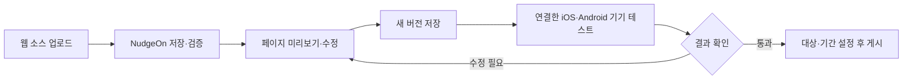
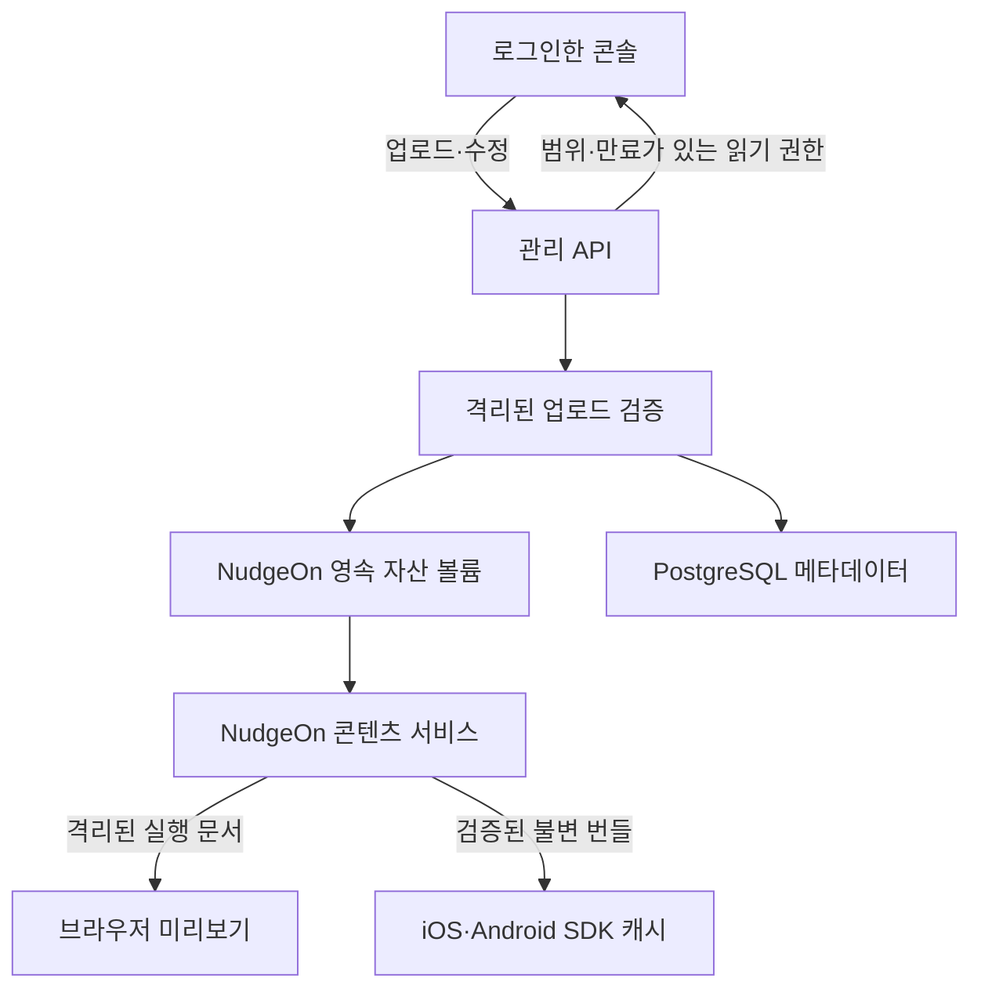
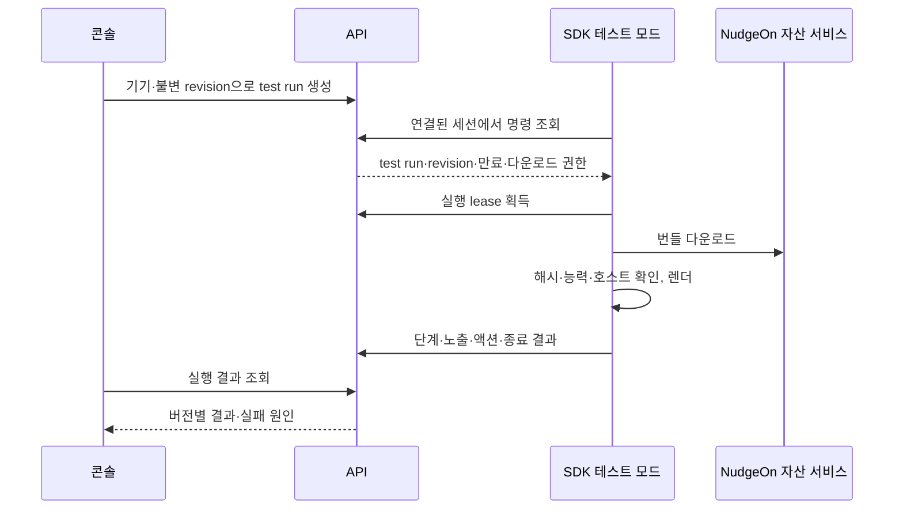

# 인앱 캠페인 개발 설계 — SDK·웹 소스 작업실

2026-09-17 · 전체 개발 설계안 · 테스트 경로 구현 중. [제품 기획](IN-APP-CAMPAIGNS-PRD.md)을 구체화한 문서입니다. 아래 경로·모듈·메서드·제한값은 개발할 계약이며 현재 동작을 의미하지 않습니다.

> 운영 캠페인 구현은 [게시·SDK 연결 안내](IN-APP-CAMPAIGNS.md), 작업실 구현은 아래 안내를 참조하세요.

> 현재 구현 범위와 실제 API/SDK 사용법은 [작업실 사용 안내](IN-APP-WORKBENCH.md)를 참조하세요. 이 문서에는 아직 구현하지 않은 운영 기능도 포함됩니다.
## 1. 확정한 범위

**HTML·CSS·JS·이미지를 NudgeOn에 올리고, NudgeOn 콘솔에서 미리보기와 실기기 테스트를 진행한 뒤 같은 버전을 캠페인으로 게시합니다.** 웹 자산의 저장과 배포는 NudgeOn이 담당합니다. 고객이 별도 웹사이트나 CDN을 만들 필요가 없습니다.

- “NudgeOn 페이지”는 로그인한 관리 콘솔의 **인앱 캠페인 → 웹 소스 작업실**입니다. 공개 홈페이지에는 이후 예제·소개를 노출합니다.
- 첫 개발 범위에 소스 업로드, 파일 수정, 브라우저 미리보기, iOS/Android SDK, 기기 연결, 실행 이력과 실패 재테스트를 함께 포함합니다.
- 템플릿도 같은 번들 형식으로 변환합니다. 템플릿과 직접 업로드에 서로 다른 전달 엔진을 만들지 않습니다.
- 브라우저는 화면과 JS 액션을 모의 실행합니다. 실기기는 네이티브 WebView·앱 이동·수명주기를 검증합니다. 미리보기 성공을 실기기 성공으로 표시하지 않습니다.
- 게시하지 않은 초안도 본인 테스트 기기에 표시할 수 있습니다. 일반 사용자에게 표시되는 운영 캠페인과 테스트를 분리합니다.
- 앱에 인앱 모듈을 처음 설치하는 업데이트는 필요합니다. 이후 지원되는 웹 콘텐츠·동작 변경은 앱 재배포 없이 반영합니다.

## 2. 콘솔 흐름과 화면



### 작업실 배치

```text
인앱 캠페인 / 가을 이벤트        초안 v3 · 저장됨
[웹 소스 업로드] [예제 받기] [저장·검증] [내 기기에서 테스트]
┌──────────────────────┬──────────────────────┬─────────────────────┐
│ 파일 목록·코드 편집   │ 휴대폰 크기 미리보기  │ 표시·버튼 설정      │
│ index.html           │ 배경 / 화면 크기     │ 중앙·전면·하단·투명 │
│ styles.css           │ 밝게 / 어둡게        │ 여백·닫기·목적지    │
│ main.js              │ 투명 영역 확인       │ 기기 연결 상태      │
│ assets/banner.webp   │ [미리보기 실행]      │ [기기 연결]         │
├──────────────────────┴──────────────────────┴─────────────────────┤
│ 검증 결과 | 실행 로그 | 기기 테스트 이력                           │
│ v3 · iPhone · 표시 확인 · 참여하기 → 앱 화면 열기 · 닫기 확인       │
└───────────────────────────────────────────────────────────────────┘
```

데스크톱은 3열, 좁은 화면은 파일/미리보기/설정을 탭으로 전환합니다. 편집 공간과 팝업 모두 바깥·안쪽 여백을 명시합니다. 초안 저장 여부와 **실행 중인 버전**을 항상 보여줍니다.

| 조작 | 동작 |
|---|---|
| 웹 소스 업로드 | HTML 또는 ZIP 선택 → 파일 검사 → 파일 목록·용량·누락 자산 안내 |
| 예제 받기 | 중앙·전면·투명 이미지 예제 ZIP과 JS 연결 예제 다운로드 |
| 파일 수정 | HTML/CSS/JS 텍스트 편집, 이미지 교체·미리보기. 바이너리 직접 편집 제외 |
| 저장·검증 | 작업 사본에서 새 불변 revision 생성. 검증 오류는 파일·위치·수정 방법과 연결 |
| 미리보기 실행 | 저장·검증된 revision을 실행. 미저장 변경이 있으면 먼저 저장·검증 |
| 화면 조건 | 너비·높이·safe area·밝기·글자 크기 모의 값. 실제 OS 에뮬레이터라고 표시하지 않음 |
| 버튼 클릭 | 액션 ID·종류·목적지를 로그로 확인. 브라우저에서는 실제 이동·발급을 실행하지 않음 |
| 내 기기에서 테스트 | 연결 기기·revision 선택 → 명시적 테스트 실행. 소스 수정만으로 앱에 자동 전송하지 않음 |
| 다시 테스트 | 이전 입력과 revision으로 새 실행 생성. 변경 버전을 고르면 새 버전임을 명확히 표시 |
| 게시 | 현재 revision의 검증·기기 테스트·대상 조건을 확인하고 게시 권한으로 실행 |

빈 상태에는 예제와 업로드 버튼, 기기 미연결 상태에는 연결 안내, 로딩 중에는 단계와 취소, 오류에는 실패 사유와 재시도를 제공합니다. 로그는 JS 오류, 리소스 로드 실패, 브리지 요청/응답, SDK 상태를 구분합니다. 사용자 입력·토큰·전체 HTML을 로그에 자동 첨부하지 않습니다.

## 3. 업로드 번들 v1

첫 버전은 **정적 웹 실행 결과물**을 받습니다. 원본 React/TSX 프로젝트나 Node/PHP 서버를 실행하지 않습니다. 프레임워크 사용 시 의존성을 포함한 단일 classic JS 번들로 빌드하고 상대 자산 경로를 사용합니다. ESM·동적 import·외부 API·Service Worker 지원은 후속 계약으로 둡니다.

```text
event.zip
├── index.html             # 필수, UTF-8
├── styles.css
├── main.js                # classic script, 외부 CDN 의존 없음
├── nudgeon.json           # 선택: 없으면 콘솔에서 생성
└── assets/
    └── banner.webp
```

- ZIP 루트의 `index.html`을 진입점으로 사용합니다. 상위 폴더 하나로 감싼 ZIP은 콘솔에서 루트를 선택한 뒤 서버에서도 동일하게 검증합니다.
- 단일 HTML은 CSS/JS 내장 또는 파일을 추가해 완성합니다. 누락된 상대 경로가 있으면 실행 가능한 상태로 만들지 않습니다.
- 허용 확장자: `.html`, `.css`, `.js`, `.json`, `.png`, `.jpg`, `.jpeg`, `.webp`, `.gif`, `.woff2`. SVG·동영상은 v1 제외하고 이미지로 변환하도록 안내합니다.
- 제안 상한: 업로드 ZIP 10MiB, 해제 총량 30MiB, 파일 200개, 개별 파일 8MiB, HTML/JS/CSS 각각 파일당 1MiB. 초과 시 파일별 해결 방법을 제공합니다.
- 계정별 총 저장량·동시 검증 수·요청 수에 별도 상한을 둡니다. 파일럿 기본 저장량은 테넌트당 1GiB로 제안하고 설정 가능하게 합니다.
- 절대 경로, `..`, 역슬래시 우회, NUL, symlink, 중첩 압축, 암호 ZIP, 중복/대소문자·정규화 충돌 경로를 거절합니다. 해제하면서 실제 바이트·시간을 제한하며 ZIP 헤더의 크기를 신뢰하지 않습니다.
- 압축 해제는 별도 임시 디렉터리와 제한된 검증 프로세스에서 수행합니다. 설치 스크립트, npm 명령, 업로드된 JS를 서버에서 실행하지 않습니다.
- 외부 스크립트·외부 CSS·절대/루트 상대 자산·`base`·자동 페이지 이동·중첩 프레임·폼 전송은 거절합니다. URL은 HTML/CSS 파서로 검사하고 정규식 검사만으로 안전을 보장하지 않습니다.
- JS가 실행 중 생성한 요청까지 정적으로 완전히 판정할 수 없으므로, 실행 시 CSP·플랫폼 네트워크/탐색 제한이 추가로 필요합니다.

선택 파일 `nudgeon.json` 예시:

```json
{
  "format_version": 1,
  "entrypoint": "index.html",
  "bridge_version": 1,
  "display": { "type": "transparent", "backdrop_opacity": 0.4 },
  "actions": {
    "join_event": { "type": "deep_link", "url": "godspell://events/autumn" },
    "close": { "type": "dismiss" }
  }
}
```

예시 딥링크는 가상 경로이며 Godspell 실제 라우터와 연결 후 사용합니다. 콘솔에서 액션 목적지를 바꾸면 새 revision이 됩니다. 앱의 허용 목록과 캠페인의 액션 등록을 **모두** 통과해야 동작합니다.

서버는 `bundle_id`, `revision_id`, `source_sha256`, `artifact_sha256`, 파일별 SHA-256·MIME·크기, `validator_version`, `runtime_version`을 생성합니다. 원본과 실행 번들을 별도로 보관하며 브리지 부트스트랩 삽입 등 변환 내역을 기록합니다. 시스템 파일 경로는 예약하여 덮어쓰지 못하게 합니다.

## 4. NudgeOn 자산 저장·배포



자산 볼륨 경로안은 `/var/lib/nudgeon/assets/{tenant}/{app}/{bundle}/{revision}/`입니다. 사용자 파일 이름을 저장 경로에 직접 연결하지 않고 서버 생성 ID와 검증된 상대 경로만 사용합니다. 업로드 API/검증기는 쓰기 권한, 콘텐츠 서비스는 게시 가능한 아티팩트에 읽기 권한만 가집니다. 검증 전 파일은 콘텐츠 서비스에서 접근할 수 없습니다.

콘텐츠 서비스도 **NudgeOn Compose 구성 요소**입니다. 관리 API·콘솔과 별개 origin에서 제공하는 이유는 실행 격리이며 외부 호스팅을 요구하는 것이 아닙니다. 셀프호스팅은 같은 서버에 별도 HTTPS 호스트를 연결하고, 위자드에서 `CONTENT_PUBLIC_ORIGIN`(신규 제안)을 설정·진단합니다. 운영에서는 콘솔과 호스트 이름도 달라야 합니다. 쿠키는 포트로 분리되지 않으므로 같은 호스트의 포트만 바꾸는 구성은 허용하지 않습니다. 자산은 계속 동일 NudgeOn 서버/볼륨에 있습니다. 로컬 개발은 인증 쿠키를 공유하지 않는 별도 개발 호스트를 사용합니다.

- 콘텐츠 서비스에는 관리 세션 쿠키·관리 API·디렉터리 목록 기능이 없습니다. 콘솔 쿠키는 host-only로 설정하고 콘텐츠 요청의 Cookie를 전달하지 않습니다.
- 원본 다운로드는 로그인한 관리 API를 통해 권한 검사 후 attachment로 제공합니다. 원본 HTML을 콘솔 origin에서 inline으로 응답하지 않습니다.
- 미리보기는 revision에만 접근하는 10분짜리 읽기 권한을 사용합니다. 불투명 URL에 담을 경우 bearer임을 전제로 access log에서 삭제하고 `Referrer-Policy: no-referrer`, `Cache-Control: no-store`를 적용합니다. 관리·SDK 인증 토큰을 URL에 넣지 않습니다.
- SDK는 네이티브 다운로드 계층에서 짧은 읽기 권한을 사용해 번들을 받은 후 해시를 확인합니다. 개인 사용자 정보와 Server Key를 자산에 포함하지 않습니다.
- 캐시는 SDK 로컬에서 해시 기준으로 공유하되 tenant/app 경계를 포함합니다. 제안 상한 30MiB·LRU, 현재 표시 파일은 제거하지 않습니다. 손상 시 한 번 다시 다운로드하고 계속 실패하면 표시하지 않습니다.
- 캐시가 있어도 운영 표시 직전 자격 조회는 필요합니다. 자산을 이미 받은 기기에서 바이트를 즉시 회수할 수 있다고 약속하지 않습니다.
- 삭제는 활성 버전·예약·테스트 참조가 없는지 확인 후 7일 유예로 처리합니다. 초안 원본과 게시 버전은 운영자가 삭제하기 전까지 보관하며 저장량 제한을 적용합니다. 검증 실패 임시 파일은 24시간 안에 정리합니다.
- 백업은 PG와 자산 볼륨의 동일한 논리 시점을 포함합니다. 복구 후 참조 파일·해시 검사, 누락 자산 경보를 제공합니다. Compose 업그레이드로 영속 볼륨을 초기화하지 않습니다.

## 5. 페이지 미리보기 런타임

브라우저 미리보기는 별도 콘텐츠 origin의 iframe에서 실행하며 `sandbox="allow-scripts"`만 허용합니다. 폼·팝업·상위 탐색·동일 origin 권한은 주지 않습니다. 응답에도 CSP sandbox를 적용하여 실행 문서를 새 탭으로 열어도 제한을 유지합니다.

이 구성의 문서는 opaque origin이므로 `event.origin === 콘텐츠 도메인` 검사를 사용할 수 없습니다. 부모는 현재 iframe의 `event.source`와 일회용 nonce로 초기 연결하고 `MessageChannel`을 넘깁니다. 이후 해당 포트·revision·preview session만 받습니다. opaque origin으로 보내는 초기 `postMessage('*')`에는 관리자 인증·개인정보를 포함하지 않습니다. nonce는 다른 창의 메시지를 구분하는 값이며 업로드된 JS 자체를 신뢰하게 만드는 비밀이 아닙니다.

- 외부 JS/CSS와 이미지·폰트는 NudgeOn에서만 로드합니다. opaque origin에서 필요한 자산 CORS는 **읽기 권한 URL의 정적 바이트에 한해서만** credentials 없이 허용하며 관리 API는 `Origin: null`을 허용하지 않습니다.
- 기본 CSP는 `default-src 'none'`, 정확한 콘텐츠 origin/해시로 제한한 `script-src`, 콘텐츠 origin과 필요한 inline CSS의 `style-src`, 해당 자산의 `img-src/font-src`, `connect-src 'none'`, `frame-src 'none'`, `worker-src 'none'`, `object-src 'none'`, `base-uri 'none'`, `form-action 'none'`로 구성합니다. script의 eval과 inline 이벤트 핸들러는 지원하지 않습니다.
- 초기 HTML의 inline script는 검증 과정에서 해시를 등록합니다. 허용된 JS만 실행할 수 있도록 런타임 부트스트랩도 같은 정책에 포함합니다.
- iframe에는 모의 데이터만 전달합니다. 실제 사용자 프로필·쿠폰·SDK 토큰은 전달하지 않습니다. 네트워크나 페이지 이동을 완전히 감사할 수 있는 환경이라고 가정하지 않고 비밀을 애초에 넣지 않습니다.
- 모의 브리지는 실제 SDK와 동일한 요청/응답 규격을 구현하되 딥링크·복사·외부 이동을 로그로만 처리합니다. 상위 콘솔에서 임의 API를 대신 실행해 주지 않습니다.
- 새 실행 시 이전 iframe과 메시지 포트를 폐기합니다. 이전 버전의 늦은 로그를 현재 실행에 섞지 않습니다.
- `window.onerror`, `unhandledrejection`, 리소스 실패, 브리지 결과를 제한된 크기로 수집합니다. 소스맵 업로드·전송은 v1 제외합니다.

동일 실행 번들의 HTML/CSS/JS 바이트와 브리지 규격을 브라우저·iOS·Android에서 공유합니다. 호스트 어댑터와 origin은 플랫폼마다 다르고 브라우저 엔진도 다르므로 픽셀 단위 동일 결과를 보장하지 않습니다. v1의 classic JS·상대 자산·폰트 로딩은 세 환경의 공통 적합성 테스트를 통과해야 합니다.

## 6. SDK 구조와 공개 계약

현재 확인된 코어는 iOS 15+ Swift Package, Android minSdk 26이며 인앱 렌더러는 별도 개발 대상입니다. 코어의 identify/reset/track/포그라운드 신호를 공통 훅으로 확장하고, 푸시 모듈과 독립적으로 동작시킵니다.

| 구성 요소 | 책임 |
|---|---|
| Core adapter | 설치 ID, identify/reset generation, 로컬 track 신호, 동의·세션 연결 |
| InApp coordinator | 후보·빈도·현재 화면, 한 번에 하나 표시, 보류/취소 |
| Asset cache | 다운로드, 압축 해제 상한, 파일·번들 해시 검사, LRU |
| Platform renderer | 투명 WebView, safe area, 네이티브 닫기, 수명주기·접근성 |
| Bridge router | 요청 스키마·현재 문서·액션 허용 목록 검증 |
| Test client | 사용자가 켠 테스트 세션 동안 기기 연결·명령 조회·결과 전송 |
| Lifecycle queue | 노출·클릭·종료·실패 기록, 제한된 재전송과 중복 제거 |

패키지안은 iOS 추가 product `NudgeOnInApp`과 Android 선택 artifact `nudgeon-inapp`입니다. 기존 SDK 사용 앱은 모듈 추가·명시적 enable 전에는 인앱 기능을 실행하지 않습니다. Android의 일시적 WebView 객체를 기존 사용자 WebView와 공유하지 않으며, 저장소를 사용하지 않는 v1 콘텐츠 정책과 실행 종료 시 정리를 적용합니다. 호스트 앱 전체 WebView 쿠키/저장소를 지워서 격리하는 방식은 사용하지 않습니다. 실제 출시 버전은 양쪽 계약 테스트 완료 시 정합니다.

언어별 이름을 맞출 신규 API 계약:

| API | 계약 |
|---|---|
| `enable(config)` | 앱의 명시적 허용 정책·호스트·콜백 연결 후 시작 |
| `screen(name)` | 현재 화면을 갱신하고 로컬 트리거 평가. 중복 분석 이벤트를 자동 생성하지 않음 |
| `pause(reason)` / `resume(reason)` | reason 집합으로 중첩 정지 관리. 다른 사유가 남으면 재개하지 않음 |
| `setAllowed(bool)` | 표시 허용 철회 시 후보·예약·표시를 취소. 분석 동의와 연동할 정책은 호스트 앱이 지정 |
| `beforeDisplay(context)` | 현재 호스트 상태에서 allow/defer/deny. 주 스레드를 기다리게 하지 않음 |
| `onAction(action)` | 검증된 앱 액션 전달. 팝업 종료 완료 후 라우팅, 결과는 success/failure/cancelled |
| `beginTestPairing(token)` / `endTestSession()` | 사용자가 시작한 테스트 모드 연결·종료 |
| `onDiagnostic(event)` | 디버그/테스트 상태. 운영에서 개인정보 포함 상세 로그 기본 비활성 |

`identify`, `reset`, 동의 철회, 장면 교체마다 generation을 갱신합니다. 모든 비동기 다운로드·예약·렌더 완료 콜백은 시작 당시 generation과 비교하고 달라졌으면 폐기합니다. iOS의 자동 세션 추적을 끈 앱도 호스트가 인앱 세션 신호를 연결할 수 있어야 합니다.

### 플랫폼별 렌더링

- iOS: UIKit 표시 컨테이너와 SwiftUI 연결, 활성 Scene 선택, `WKWebView.isOpaque = false`, 투명 배경, 비영속 website data store. 검증된 파일만 제공하는 전용 `WKURLSchemeHandler`를 사용하고 임의 file URL 접근을 열지 않습니다.
- iOS 브리지: `WKScriptMessage.frameInfo`의 메인 프레임·현재 문서 URL과 origin, 실행 ID를 검증합니다. 전용 scheme의 실제 frame origin 표현을 표시 실험에서 고정하여 계약 테스트에 넣습니다. 종료 시 handler·관찰자를 제거하고 참조 순환을 방지합니다.
- Android: resumed Activity에서 투명 Dialog/Fragment 표시. `WebViewAssetLoader`로 앱 전용 HTTPS origin의 검증된 파일만 제공하며 file/content 접근·mixed content·외부 탐색을 차단합니다.
- Android 브리지: `WebViewCompat.addWebMessageListener`의 명시적 `allowedOriginRules`, `sourceOrigin`, `isMainFrame`을 검사합니다. `WEB_MESSAGE_LISTENER` 미지원 WebView에서는 인앱 기능을 제외합니다. 호출 프레임 origin을 확인할 수 없는 `addJavascriptInterface`로 낮춰 실행하지 않습니다.
- 양쪽 모두 JS alert/confirm, 파일 업로드, 카메라·마이크·위치 권한, 팝업 창, 외부 하위 리소스를 차단합니다. 메인 문서 이동도 닫기/등록 액션 외에는 거절합니다.
- 다운로드와 준비 중에는 앱을 가리지 않습니다. HTML 준비 신호를 받고 현재 상태를 재검사한 뒤 표시합니다. 준비 제한 시간은 5초를 제안하며 실패 시 네이티브 자원을 모두 정리합니다.
- 네이티브 닫기·Android back·앱 백그라운드·허용 철회는 HTML이 막을 수 없습니다. 회전/호스트 소멸 시 첫 버전은 닫고 자동 재표시하지 않습니다.

## 7. JavaScript 브리지 v1

```javascript
// 신규 API 예시. 부트스트랩은 NudgeOn이 삽입하며 CDN script를 직접 넣지 않습니다.
window.addEventListener('nudgeon:ready', () => {
  document.querySelector('#join').addEventListener('click', async () => {
    try {
      await window.nudgeonBridge.performAction('join_event');
    } catch (error) {
      // 동작 실패 시 안내. 쿠폰 발급 완료로 간주하지 않습니다.
    }
  });
  document.querySelector('#close').addEventListener('click', () => {
    window.nudgeonBridge.dismiss('close_button');
  });
  // 초기 레이아웃과 필수 이미지 준비가 끝난 시점에 호출합니다.
  window.nudgeonBridge.ready();
});
```

`nudgeon:ready`는 통신 준비, `ready()`는 콘텐츠 준비이며 **실제 노출과 다릅니다**. ready는 같은 실행에서 멱등입니다. 네이티브가 화면을 표시하고 PRD의 실제 노출 조건을 만족했을 때만 노출을 기록합니다.

전송 envelope는 `{protocol:1, request_id, execution_id, nonce, method, payload}`입니다. 응답은 같은 `request_id`와 `{ok:true,result}` 또는 `{ok:false,error:{code,message}}`를 반환합니다. 제안 제한은 요청당 8KiB·초당 20건, 5초 응답 제한이며 종료 시 대기 Promise를 `DISPLAY_CLOSED`로 정리합니다.

v1 메서드는 `ready`, `performAction(action_id)`, `dismiss(reason)`입니다. `performAction`은 액션 ID만 받으며 임의 URL·토큰·네이티브 메서드를 받지 않습니다. 같은 요청 ID 재전송은 같은 결과를 반환하고, 표시당 한 번인 이동 액션에는 별도 중복 실행 방지 키를 적용합니다. 콘텐츠가 생성한 클릭은 참여 의도를 완벽히 증명하지 않으므로 금전성 보상·권한 부여에 사용하지 않습니다.

일반 `fetch` 프록시, 사용자 전체 프로필 조회, arbitrary native call, 임의 분석 이벤트 수집은 v1 브리지에 포함하지 않습니다. 여러 화면 전환·애니메이션은 웹 내부에서 가능하며 설문 응답 저장·서버 참여 처리는 후속으로 별도 정의합니다.

## 8. 기기 연결과 테스트 실행

### 연결

1. 콘솔에서 앱을 선택하고 “기기 연결”을 누르면 128bit 이상 일회용 토큰을 QR/앱 연결 링크로 발급합니다. 만료 5분, tenant/app/operator에 연결합니다.
2. 앱이 SDK의 테스트 연결 화면을 열고 앱 이름·서버·테스트 모드임을 표시합니다. 사용자가 허용한 뒤 설치 자격으로 토큰을 교환합니다. QR 스캐너 자체를 SDK 필수 요소로 두지 않고 호스트 딥링크로 전달할 수 있습니다.
3. 콘솔에 기기·OS·앱/SDK/WebView 버전·짧은 확인 숫자를 표시하고 같은 숫자를 앱에 표시합니다. 운영자가 확인한 뒤 테스트 권한을 활성화합니다. 잘못된 기기가 먼저 토큰을 받은 경우 거절하고 토큰을 재발급합니다.
4. 테스트 세션은 30분 뒤 만료되며 앱·콘솔 양쪽에서 즉시 해제할 수 있습니다. 실행을 마치고 자동 운영 캠페인을 시작하지 않습니다.

설치 등록은 푸시 등록과 분리합니다. 서버가 발급한 installation credential을 Keychain/Android 보호 저장소에 보관하고 HTML에 전달하지 않습니다. 공개 SDK Key만으로 이미 등록된 설치의 자격을 재발급하거나 다른 기기로 명령을 조회할 수 없게 합니다. 이 자격은 고객 본인 인증이 아니며 개인화 권한은 별도 검증이 필요합니다.

### 실행



초기 전송은 포그라운드의 활성 테스트 세션에서만 3초 간격 polling으로 구현합니다. 기기 heartbeat 30초 초과 시 “연결 대기”로 표시합니다. APNs/FCM이나 푸시 허용이 없어도 가능합니다. SSE/WebSocket은 동시 접속과 필요성을 측정한 뒤 도입합니다.

- 테스트 run 대기 유효기간은 2분, 실행 lease는 30초·heartbeat로 갱신하되 전체 5분을 상한으로 제안합니다. 기기당 하나만 실행합니다. SDK 단조 시계의 로컬 watchdog도 실행 상한을 강제하여 통신이 끊겨도 테스트 팝업이 남지 않게 합니다.
- SDK가 `test_run_id`를 영속적으로 수락한 뒤 다운로드·표시합니다. 응답 유실로 명령이 재조회되어도 같은 실행을 다시 표시하지 않습니다. lease를 잃거나 재시작하면 해당 실행은 실패/중단으로 끝내고 사용자가 새 테스트를 실행합니다.
- 서버 시각으로 만료·취소 여부를 표시 직전 확인합니다. 취소와 표시가 경쟁하면 이미 표시됐을 수 있음을 기록하고 다음 poll에서 닫습니다. 오프라인에서 취소가 즉시 전파된다고 가정하지 않습니다.
- 테스트는 운영 대상·기간·빈도만 우회합니다. 동의 정책·현재 호스트의 표시 금지·지원 능력·네이티브 보안 규칙은 우회하지 않습니다. 운영 팝업이 열려 있으면 종료될 때까지 테스트를 실행하지 않습니다.
- 기본 브라우저 테스트는 mock 액션, 실기기 테스트는 앱이 허용한 실제 딥링크/복사 액션을 사용합니다. 실제 동작임을 실행 버튼 옆에 표시합니다. 혜택 발급은 v1 범위 밖입니다.

상태는 `queued → claimed → preparing → presented → completed`이며 어느 단계에서든 `failed/cancelled/expired`로 종료할 수 있습니다. `bridge_ready`, `content_ready`, `impression`, `action`, `dismiss`는 시간순 이벤트입니다. `completed`는 실행 종료이지 시각 검수 합격이 아니며 운영자가 닫기·레이아웃·목적지를 확인해 별도 `review_result=pass/fail`을 기록합니다.

실패 목록에는 기기, OS/SDK, revision, 실패 단계, 오류 코드, 마지막 응답 시각, 재실행 링크를 표시합니다. 오류 예: `INVALID_BUNDLE`, `ASSET_HASH_MISMATCH`, `DEVICE_OFFLINE`, `UNSUPPORTED_WEBVIEW`, `HOST_BLOCKED`, `BRIDGE_TIMEOUT`, `CONTENT_TIMEOUT`, `ACTION_NOT_ALLOWED`, `RUN_EXPIRED`. 다시 테스트는 `retry_of`를 가진 새 run이며 이전 실패 기록을 보존합니다. 자동으로 일반 사용자에게 재전송하지 않습니다.

테스트 실행/로그는 기본 14일 보관, 게시 근거인 검수 결과·버전 해시·감사 이력은 별도 장기 메타데이터로 유지합니다. 실제 기기 화면 스트리밍·자동 스크린샷은 v1 제외합니다. 콘솔은 실기기 결과와 로그를 보여주며 실제 렌더링은 기기에서 확인합니다.

## 9. API와 데이터 계약

모든 경로는 제안입니다. 관리 API는 현재 DB 세션·권한·CSRF 정책을 적용합니다. OpenAPI와 `@nudgeon/api-client`를 함께 확장하고 multipart/바이너리 전송도 클라이언트 내부에서 처리합니다.

| 구분 | 제안 경로 | 의미 |
|---|---|---|
| 관리 | `POST /v1/apps/{appId}/in-app/bundles` | 제한된 multipart로 원본 저장, 202와 검증 job 반환 |
| 관리 | `GET .../bundles/{id}` | 검증 상태·파일·오류·revision 조회 |
| 관리 | `POST .../bundles/{id}/revisions` | base revision + 파일 수정분으로 새 검증 버전 생성 |
| 관리 | `POST .../revisions/{id}/preview-sessions` | 격리된 미리보기 문서의 단기 읽기 권한 |
| 관리 | `POST .../test-pairings` | QR 연결 토큰 생성 |
| 관리 | `POST .../test-pairings/{id}/confirm` | 일치 기기 확인 후 세션 활성화 |
| 관리 | `DELETE .../test-sessions/{id}` | 연결 해제·대기 명령 취소 |
| 관리 | `POST .../test-runs` | installation·revision·Idempotency-Key로 실행 생성 |
| 관리 | `GET .../test-runs` / `GET .../test-runs/{id}` | 실패 필터·단계별 결과·cursor 이후 로그 |
| 관리 | `POST .../test-runs/{id}/cancel` / `.../review` | 취소 또는 시각 검수 기록 |
| 관리 | `POST .../campaigns/{id}/publish` | expected revision/ETag·테스트 근거와 함께 게시 |
| SDK | `POST /v1/in-app/installations` | 앱 범위 설치 자격 발급, 등록 제한·재발급 정책 적용 |
| SDK | `POST /v1/in-app/test-pairings/claim` | 토큰·설치 자격으로 연결 요청 |
| SDK | `GET /v1/in-app/test-commands` | 본인 활성 테스트 세션 명령 조회 |
| SDK | `POST /v1/in-app/test-runs/{id}/claim` / `.../heartbeat` | 원자 lease 획득·연장 |
| SDK | `POST /v1/in-app/test-runs/{id}/events` | 실행 자격·lease generation·event ID로 상태 기록 |
| SDK | `GET /v1/in-app/manifest` | 운영 후보·능력·ETag |
| SDK | `POST /v1/in-app/decisions` / `.../events` | PRD의 단기 표시 예약과 운영 기록 |

관리 경로의 `...`는 `/v1/apps/{appId}/in-app`입니다. tenant는 인증 문맥에서 결정하고 app 접근 권한을 대조합니다. SDK 경로는 installation/app 문맥을 서버에서 확인합니다. 테스트/운영 자격을 서로 사용할 수 없게 scope를 나눕니다. 동일 멱등 키에 다른 본문은 409, 다른 tenant 객체는 404, 초과 크기는 413, 검증 실패는 422, 요청 제한은 429로 표준 오류 코드를 제공합니다.

| PostgreSQL 테이블안 | 핵심 데이터·제약 |
|---|---|
| `in_app_bundles` | tenant/app, 소유자, 이름, 현재 작업 revision |
| `in_app_revisions` | 불변 원본/실행 해시, manifest, validator/runtime 버전, 검증 상태 |
| `in_app_assets` | revision·정규화 경로 UNIQUE, 크기·MIME·해시·내부 storage key |
| `sdk_installations` | tenant/app/install UNIQUE, 자격 해시·회전 정보, SDK 능력·마지막 접속 |
| `in_app_test_pairings` / `in_app_test_sessions` | 해시한 일회용 토큰, operator·설치·권한·만료·폐기 |
| `in_app_test_runs` | revision, 설치, state, lease generation, retry_of, review 결과 |
| `in_app_test_events` | run/event ID UNIQUE, SDK sequence·서버 수신시각, 제한된 진단 payload |
| `in_app_campaigns` / `in_app_publications` | 초안/활성 버전·조건·일정·게시 감사 정보 |
| `in_app_reservations` / `in_app_frequency` | 운영 예약·멱등 키·계정/설치 빈도·오늘 그만 보기 |

모든 테이블·복합 FK·UNIQUE에 필요한 tenant/app 범위를 포함하여 타 테넌트 revision을 참조할 수 없게 합니다. 상태 변경·lease 획득은 트랜잭션/CAS로 처리하고 클라이언트가 임의 state를 덮어쓰지 못하게 합니다. 늦은 이벤트는 이력에 남기되 종료 run을 되살리지 않습니다. 위 표는 논리 설계이며 DDL과 인덱스는 계약 구현 단계에서 확정합니다.

검증 job은 PG 원장과 outbox를 사용하고 Redis Streams는 기존 libqueue로 전달합니다. 중복 작업은 같은 job ID에 멱등이며 중간 실패 시 임시 아티팩트를 폐기합니다. ClickHouse에는 운영 지표를 기록하되 테스트 원장·빈도 판정은 PG에 둡니다. SDK의 `test=true` 선언만 신뢰하지 않고 서버가 실행 자격으로 분류합니다.

## 10. 게시·권한·롤백

- Viewer는 조회, Editor는 업로드·편집·테스트, Owner/Admin은 게시·중지·자산 삭제를 기본 매핑으로 제안합니다. 모든 변경·연결·테스트·게시를 감사 로그에 기록합니다.
- 게시 조건은 검증 완료, 현재 runtime 호환, 대상 OS마다 **같은 revision**의 실기기 표시·네이티브 닫기와 설정된 액션 검수 통과입니다. iOS만 대상으로 설정했다면 Android 결과를 요구하지 않습니다.
- 마지막 테스트 뒤 HTML·이미지·액션 목적지·표시 설정이 달라지면 새 revision이고 검수가 다시 필요합니다. 대상·기간만 바꾸면 콘텐츠 검수는 재사용하되 대상·일정 요약을 다시 확인합니다.
- 게시된 번들을 덮어쓰지 않습니다. 업데이트는 새 publication으로 연결하고, 롤백은 이전 검증 revision을 새 publication으로 다시 활성화합니다. 캠페인 ID와 빈도·오늘 그만 보기 상태는 유지합니다.
- 잘못된 콘텐츠는 “일시중지”로 새 예약을 막습니다. 이미 발급된 표시 토큰과 열린 팝업의 최대 지연은 PRD를 따릅니다.
- 자산 읽기 권한은 개인별 비밀 데이터 보호 수단이 아닙니다. 참여 보상과 개인 정보는 공개 SDK 키·HTML에 저장하지 않고 후속 서버 액션 계약에서 다룹니다.

## 11. 저장소별 작업과 구현 순서

| 순서 | 저장소·위치 | 완료 산출물 |
|---|---|---|
| 1. 공통 계약 | platform `packages/openapi`, 신규 `packages/in-app-contracts` | manifest·bridge·test run 스키마, 오류 코드, 3개 예제·악성/손상 fixture |
| 2. 표시 실험 | iOS SDK 신규 InApp target, Android SDK 신규 inapp module | 동일 번들의 투명 표시·safe area·네이티브 닫기·제한 브리지·능력 보고 |
| 3. 자산 경로 | platform `apps/api`, 신규 검증 프로세스/콘텐츠 서비스, `db/postgres` | 업로드→검증→불변 저장→권한 있는 읽기, tenant 격리·정리·마이그레이션 |
| 4. 페이지 작업실 | platform `apps/console`, 신규 브리지 JS 패키지 | 파일 편집·검증·격리 preview·모의 액션 로그·한/영 문구 |
| 5. 테스트 연결 | platform API/console + 두 SDK | QR 연결·확인·실기기 명령·단계 로그·실패 목록·다시 테스트 |
| 6. 운영 캠페인 | platform API/console/worker + SDK coordinator | 템플릿, 조건·기간·빈도·예약·게시·중지·성과 |
| 7. 설치·파일럿 | platform `deploy`, 설치 위자드/doctor/공개 문서 + Godspell | 콘텐츠 origin·볼륨·백업 설정, 양 OS 실제 앱 검증 |

SDK와 콘솔을 각각 완료한 뒤 처음 연결하지 않습니다. 2~5단계 동안 공통 예제로 매 단계 끝에 **업로드 → 페이지 확인 → 같은 버전 앱 표시**를 연결해 검증합니다. 각 SDK 저장소의 PR은 공통 계약 revision을 명시하고, 양쪽 SDK가 지원하지 않는 기능을 서버에서 활성화하지 않습니다.

기존 코드 재사용 경계:

- `apps/console/src/app/journeys/email-template-zip.ts`의 파일 검사 경험을 참고하되 이메일용 script 제거 로직은 재사용하지 않습니다. 서버 검증이 최종 판정입니다.
- `packages/openapi/src/index.ts`는 현재 수기 클라이언트입니다. OpenAPI와 함께 확장하고 콘솔에서 우회 fetch를 추가하지 않습니다.
- `send.message.v1`의 `in_app` 필드는 예약된 형태일 뿐 실행 구현이 아닙니다. 첫 버전은 단독 캠페인 경로를 만들고 저니 확장은 별도 단계로 둡니다.
- 기존 migration 파일을 수정하지 않고 다음 번호로 추가합니다. 기존 Go Clock·libqueue·tenant 필터 규칙을 따릅니다.
- Godspell은 iOS `NudgeOnBridge`, Android `NudgeOnSetup`을 출발점으로 사용합니다. 실제 홈 화면·딥링크·분석/마케팅 동의 정책을 연결하고, iOS/Android의 행동 이벤트 전달 여부를 각각 검증합니다.

## 12. 완료 판정

| 검증 | 통과 조건 |
|---|---|
| 기본 흐름 | 예제 ZIP 업로드→페이지 실행→기기 연결→양 OS 테스트→게시까지 별도 호스팅 없이 완료 |
| 버전 일치 | 브라우저·SDK·게시 결과의 artifact hash 일치. 미저장/수정 버전을 이전 검수로 게시하지 못함 |
| 투명 팝업 | 실제 앱이 뒤로 보이고 뒤 앱 터치는 막힘. 닫기·접근성·safe area·화면 회전·키보드 검증 |
| 업로드 경계 | 경로 탈출·압축 폭탄·symlink·MIME 위장·외부 스크립트·용량 초과를 명확한 사유로 거절 |
| 실행 격리 | 콘솔 세션/DOM 접근, 새 창·폼·파일 접근, iframe 브리지 호출·임의 URL 액션 차단 |
| 테스트 권한 | 토큰 재사용·만료·다른 앱/tenant/installation 명령 조회·취소 후 신규 실행 차단 |
| 연결 실패 | 오프라인·lease 유실·응답 유실·중복 명령·앱 재시작으로 이중 팝업이 생기지 않음 |
| 실패 재실행 | 실패 원본 보존, 동일 revision 새 run 생성, retry_of로 연결, 운영 사용자에게 전송되지 않음 |
| 상태 정리 | 로그아웃·동의 철회·background·호스트 소멸·WebView 종료 후 남은 팝업/handler 없음 |
| 지표 | 실제 노출 이전 준비 이벤트를 노출로 세지 않고, 순서 변경·재전송 중복과 테스트 분리 검증 |
| 셀프호스팅 | 위자드 origin 연결 진단, 컨테이너 재생성 후 자산 유지, DB+자산 백업/복원 통과 |
| 회귀 | 기존 푸시·identify/reset/track 경로와 모듈 미적용 앱 동작 유지 |

전체 설계 중 테스트 경로의 구현 범위와 차이는 [작업실 사용 안내](IN-APP-WORKBENCH.md)를 따릅니다. 동작 검증은 위 구현 단계에서 실행하며, Android WebView 기능 지원·iOS custom scheme 메시지 검증·opaque iframe 자산 로딩은 첫 표시 실험의 선행 통과 조건입니다. 통과하지 못하면 권한을 느슨하게 풀지 않고 지원 범위 또는 로더를 조정합니다.

## 13. 확인한 근거

- [현재 제품 기획](IN-APP-CAMPAIGNS-PRD.md): 운영 캠페인의 노출 조건·예약·빈도·지표 기준.
- [iOS SDK Package.swift](https://github.com/NudgeOn/nudgeon-ios-sdk/blob/main/Package.swift), [Android SDK build.gradle.kts](https://github.com/NudgeOn/nudgeon-android-sdk/blob/main/nudgeon/build.gradle.kts): 확인 당시 최소 지원 OS와 모듈 구성. main은 변경 가능하므로 구현 시작 시 버전 고정.
- [Android WebMessageListener](https://developer.android.com/reference/androidx/webkit/WebViewCompat.WebMessageListener), [WebViewCompat](https://developer.android.com/reference/androidx/webkit/WebViewCompat): sourceOrigin·메인 프레임·기능 지원 검사 계약.
- [Android native bridge 위험](https://developer.android.com/privacy-and-security/risks/insecure-webview-native-bridges): addJavascriptInterface의 프레임/origin 검증 한계.
- [Android WebViewAssetLoader](https://developer.android.com/reference/androidx/webkit/WebViewAssetLoader): 앱 자산을 HTTP(S) origin으로 제공하는 로더.
- [Apple WKScriptMessage.frameInfo](https://developer.apple.com/documentation/webkit/wkscriptmessage/frameinfo): 호출 프레임 확인 API.
- [MDN iframe](https://developer.mozilla.org/en-US/docs/Web/HTML/Reference/Elements/iframe), [CSP sandbox](https://developer.mozilla.org/en-US/docs/Web/HTTP/Reference/Headers/Content-Security-Policy/sandbox): opaque origin·sandbox 동작. 이 문서의 저장·토큰·테스트 흐름은 NudgeOn 신규 설계.
