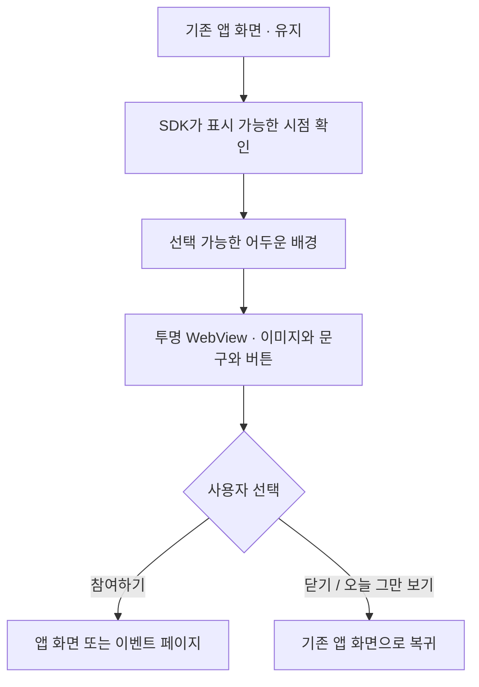
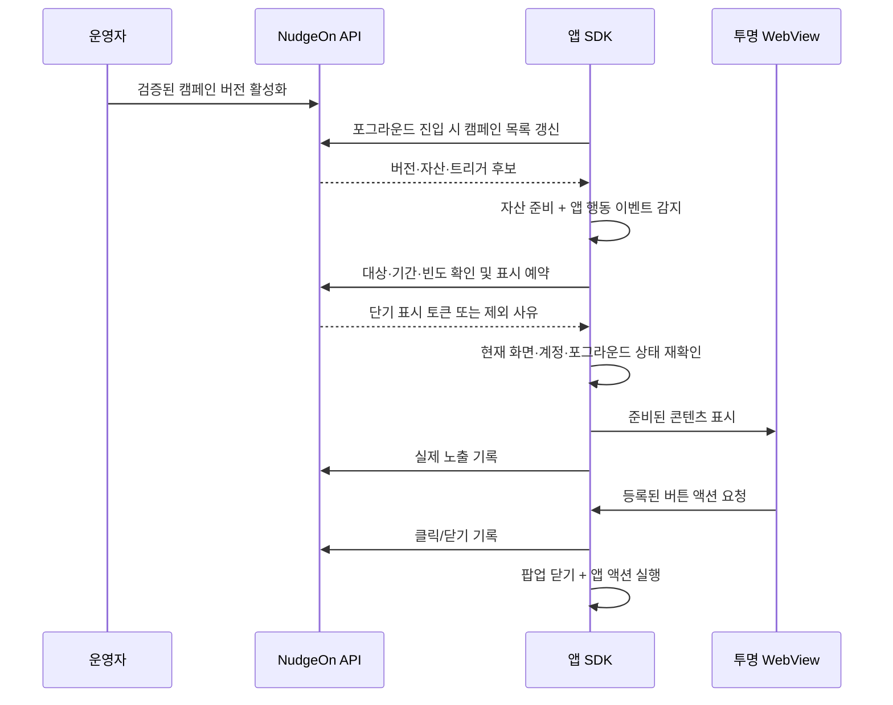

# NudgeOn 인앱 캠페인 — 투명 WebView 팝업 기획

2026-09-17 · 제품 계획 · 테스트 경로 구현 중. 현재 코드와 Braze 공식 문서를 확인해 작성한 제품·개발 계획입니다. 이 문서의 API·SDK 메서드와 수치는 신규 설계안이며, 현재 제공 기능이나 측정 결과가 아닙니다. SDK·웹 소스 업로드·테스트 환경의 상세 계약은 [개발 설계](IN-APP-CAMPAIGNS-DESIGN.md)를 따릅니다.

> 현재 구현 범위와 실제 API/SDK 사용법은 [작업실 사용 안내](IN-APP-WORKBENCH.md)를 참조하세요. 이 문서에는 아직 구현하지 않은 운영 기능도 포함됩니다.
## 1. 만들 기능

**운영자가 NudgeOn에서 이벤트 화면을 만들고, 원하는 고객이 앱을 사용하는 순간 팝업으로 보여주는 기능.**

앱 화면 위에 투명한 WebView를 겹쳐 이미지·문구·버튼·간단한 참여 화면을 표시합니다. 팝업을 닫으면 사용하던 앱 화면으로 돌아갑니다. 앱에 인앱 표시용 SDK를 한 번 적용한 뒤에는, 지원되는 템플릿과 동작 범위에서 앱 업데이트 없이 캠페인 내용·기간·대상·노출 조건을 변경합니다. 새로운 네이티브 기능이나 아직 수집하지 않는 앱 행동은 앱 연동 작업이 필요합니다.

- 운영자: 템플릿을 편집하거나 HTML·CSS·JS·이미지를 NudgeOn에 업로드하고, 페이지 미리보기·실기기 테스트 후 이벤트를 예약·시작·중지합니다.
- 앱 사용자: 팝업을 보고 이벤트 페이지를 열거나 쿠폰 코드를 복사하거나 닫습니다.
- 개발자: 표시 SDK·화면 식별자·딥링크 처리·노출 금지 구간을 처음에 연결합니다.
- 용어: **캠페인/프로모션**은 운영자가 만드는 이벤트 행사, **행동 이벤트**는 `screen_view` 같은 SDK 수집 신호를 뜻합니다.

예시: “9월 이벤트” 이미지 등록 → 홈에 들어온 사용자에게 하루 한 번 표시 → “참여하기”를 누르면 이벤트 상세 화면으로 이동 → 노출·클릭·참여 완료를 확인.

## 2. 고객에게 보이는 모습

| 형식 | 사용 예 | 첫 버전 |
|---|---|---|
| 중앙 팝업 | 이미지·문구·버튼이 있는 이벤트 안내 | 포함 |
| 전면 팝업 | 화면을 크게 쓰는 프로모션·새 기능 소개 | 포함 |
| 하단 팝업 | 쿠폰 안내·참여 유도 | 포함 |
| 자유형 투명 팝업 | 배경 없는 PNG/WebP와 버튼을 앱 위에 표시 | 포함 |
| 상단 배너·앱 안에 삽입하는 배너 | 앱 사용을 계속하며 보여주는 안내 | 후속 |
| HTML 참여 화면 | 업로드한 HTML/CSS/JS로 소개·애니메이션·간단한 인터랙션 | 포함. 응답 저장·보상 지급은 별도 후속 계약 |
| 룰렛·추첨·개인별 쿠폰 지급 | 실제 혜택이 있는 참여 이벤트 | 후속, 고객사 서버 연동 필요 |



투명도는 디자인이고 터치 처리는 별도 정책입니다. **첫 버전의 팝업이 열린 동안 뒤의 앱은 누를 수 없습니다.** 투명 영역을 누르면 캠페인 설정에 따라 닫거나 아무 동작도 하지 않습니다. 뒤 화면을 눌러야 하는 배너는 후속 기능에서 별도 네이티브 터치 영역으로 구현합니다. CSS `pointer-events`만으로 네이티브 앱까지 터치가 통과한다고 가정하지 않습니다.

공통 표시 규칙:

- 배경 어둡기 0~70%, 기본 40%. 자유형 팝업은 기본 0%.
- 중앙·하단형 기본 바깥 여백 24px, 내용 안쪽 여백 24px. 크기는 조절하되 작은 화면에서도 닫기 버튼이 잘리지 않습니다.
- 상태 표시줄·노치·하단 홈 영역은 플랫폼 safe area를 따릅니다.
- 닫기 버튼은 HTML 밖의 네이티브 영역에 항상 제공합니다. 최소 터치 영역은 iOS 44pt, Android 48dp를 제품 기준으로 둡니다.
- Android 뒤로 가기와 iOS 접근성 닫기를 지원합니다. 팝업 동안 뒤 화면의 접근성 포커스를 차단하고, 닫으면 원래 포커스로 복귀합니다.
- 화면 회전·다크 모드·큰 글꼴·키보드·스크린 리더를 실기기에서 확인합니다.
- 흰 화면이나 빈 WebView를 먼저 보여주지 않습니다. 자산과 표시 준비가 끝난 뒤 한 번에 열고, 준비 실패 시 앱 사용을 계속합니다.

## 3. 운영자 화면과 사용 순서

대시보드에 **인앱 캠페인** 메뉴를 추가합니다. 처음에는 저니를 만들지 않아도 단독 이벤트를 시작할 수 있게 합니다.

### 캠페인 목록

이름, 상태, 기간, 트리거, 대상, 노출 수, 클릭률, 마지막 수정자를 표시합니다. 검색·상태 필터·복제·일시중지·종료를 제공합니다. 초안 / 예약 / 진행 중 / 일시중지 / 종료 / 보관을 구분합니다.

### 만들기 — 5단계

1. **시작 방식 선택:** 템플릿 또는 웹 소스 업로드(HTML/ZIP). 중앙·전면·하단·자유형 표시 방식을 지정.
2. **내용 만들기:** 템플릿 편집 또는 HTML·CSS·JS·이미지 업로드. 파일별 검증 결과·코드·휴대폰 크기 미리보기·버튼 동작 로그를 같은 페이지에서 확인. 웹 자산은 NudgeOn 서버가 저장·배포하며 별도 호스팅이 필요 없음.
3. **누구에게·언제:** 앱, 대상 세그먼트, OS·앱 버전, 앱 실행/특정 화면/행동 이벤트, 시작·종료 시각, 우선순위와 노출 횟수 지정.
4. **내 기기에서 확인:** 등록한 테스트 기기에 초안 버전을 표시. 실제 이미지·여백·버튼 목적지·닫기·오늘 그만 보기를 확인. 테스트 결과는 운영 지표에서 제외.
5. **예약 또는 시작:** 대상·기간·노출 조건·빈도·테스트 결과 요약을 보고 활성화. 진행 중인 버전을 직접 덮어쓰지 않고 새 초안을 발행.

주요 버튼 문구는 “미리보기”, “내 기기에서 테스트”, “예약하기”, “시작하기”, “일시중지”로 통일합니다. 템플릿 화면은 쉬운 운영 용어를 사용하고, 웹 소스 작업실에서는 파일·코드·실행 오류를 개발자에게 명확히 표시합니다.

버튼 동작:

| 동작 | 첫 버전 동작 계약 |
|---|---|
| 앱 화면 열기 | 앱이 허용한 딥링크를 네이티브 라우터에 전달. 팝업 종료 후 화면 이동 |
| 웹페이지 열기 | 허용된 HTTPS 링크를 별도 인앱 브라우저 또는 외부 브라우저로 열기 |
| 코드 복사 | 캠페인에 입력한 공개 프로모션 코드를 사용자 터치로 복사하고 완료 표시 |
| 닫기 | 닫기 사유 기록 후 기존 화면 복귀 |
| 참여 동작 연결 | 후속 단계에서 사전 등록된 앱 액션 또는 고객사 서버로 연결 |

“쿠폰 받기” 클릭은 실제 쿠폰 발급 완료가 아닙니다. 첫 버전은 공개 코드 복사나 발급 페이지 이동을 지원합니다. 개인별 쿠폰·포인트·당첨 결과는 고객사 서버의 확인 응답을 받아야 완료로 기록합니다.

## 4. 노출 조건과 기본값

운영자가 반복해서 캠페인을 만들 수 있도록 자주 쓰는 조건을 프리셋으로 제공합니다. 모든 수치는 첫 버전의 제안 기본값이며 파일럿 결과로 조정합니다.

| 설정 | 제안 기본값 |
|---|---|
| 트리거 | 앱 첫 활성화 후 표시 가능한 시점, 최소 2초 뒤 |
| 특정 화면 | 앱이 보고한 `screen_view`와 화면 이름 일치 |
| 사용자 행동 | SDK가 보고한 이벤트 이름과 허용된 속성 조건 일치 |
| 대상 | 기존 세그먼트 재사용, 서버가 자격 판정 |
| 동일 캠페인 빈도 | 동일 고객·설치 기준 하루 1회 |
| 전체 팝업 빈도 | 세션당 1회, 최소 간격 30초 |
| 오늘 그만 보기 | 앱의 설정 타임존에서 다음 자정까지 캠페인 단위로 제외 |
| 동시 후보 | 우선순위 → 발행 시각 → 캠페인 ID로 결정, 한 번에 하나 |
| 보여주지 않을 구간 | 결제·로그인·권한 요청·재생 등 앱이 등록한 금지 구간 |
| 표시를 미룰 시간 | 같은 세션·화면 맥락에서 최대 30초. 화면 이탈 시 폐기 |
| 미지원 SDK | 지원되는 버전만 대상. 구버전에는 표시하지 않음 |

화면 전환을 SDK가 자동으로 전부 알아낸다고 가정하지 않습니다. 개발자가 화면 식별자를 연결해야 “홈에서만”, “결제 중 제외” 조건이 작동합니다. 사용 가능한 이벤트·속성은 콘솔에서 수집 여부와 함께 보여줍니다.

상태 변경 정책:

- 운영 중인 캠페인을 수정하면 새 버전이 생성됩니다. “오늘 그만 보기”와 캠페인 횟수는 같은 캠페인 ID를 유지하므로 단순 수정만으로 초기화하지 않습니다.
- 로그인·로그아웃·계정 전환 때 이전 고객의 후보, 예약, 화면을 폐기합니다. 발급된 표시 토큰은 고객·설치·버전에 연결합니다.
- 익명 고객은 설치 단위로 제한됩니다. 재설치·다중 기기를 동일 인물로 완벽히 묶는다고 약속하지 않습니다. 인증된 고객 연결이 있는 경우에만 고객 단위 제한을 확장합니다.
- 네트워크가 없을 때는 첫 버전에서 새 팝업을 열지 않습니다. 다운로드된 이미지가 있어도 자격·중지 상태 확인에 실패하면 표시하지 않습니다.
- 푸시 알림 권한과 인앱 표시 허용은 별개입니다. 푸시를 거부한 사람에게도 앱 정책상 허용된 인앱 메시지는 표시할 수 있지만, 마케팅·분석 동의 설정은 따로 존중합니다.

## 5. 표시 구조와 중지 동작



추천 구조는 **콘텐츠 미리 받기 + 표시 직전 서버 확인**입니다. 운영자는 매번 직접 발송할 필요 없이 규칙을 활성화하고, SDK가 사용자 행동과 현재 화면을 판단합니다. 푸시 알림이나 APNs/FCM 토큰을 인앱 전달의 필수 조건으로 두지 않습니다.

- 포그라운드 진입·고객 변경·설정 갱신 때 목록을 조회하고, 활성 앱에서는 기본 60초 간격과 jitter로 버전을 확인합니다. ETag·요청 합치기·백오프로 반복 다운로드를 줄입니다.
- 이미지·폰트·HTML은 게시된 버전별 불변 자산으로 저장하고 해시를 검증합니다. 렌더러 버전도 고정해 미리보기와 실제 표시 차이를 줄입니다.
- 실제 표시 직전에 서버가 상태·일정·대상·빈도를 확인하고 원자적으로 1건 예약합니다. 동일 요청 키 재시도에는 같은 예약을 반환합니다.
- 트리거 요청에는 발생 ID·시각·허용된 이벤트 속성을 함께 전달합니다. `track` 수집·분석 반영보다 표시 요청이 먼저 도착할 수 있으므로, 분석 저장소의 반영 완료를 트리거 감지의 전제 조건으로 두지 않습니다. 대상 세그먼트는 평가 시각과 유효기간을 기록하고, 신선도를 보장하지 못하면 재평가하거나 표시를 생략합니다.
- 표시 토큰 유효기간은 제안 5초, 자격 조회 제한 시간은 제안 1초입니다. 토큰이 만료되면 재확인합니다. 화면 표시 직전 토큰과 계정 generation을 다시 비교합니다.
- 서버 일시중지 후 신규 예약은 차단됩니다. 이미 발급된 토큰은 최대 5초 안에서 표시될 수 있으며, 이미 열린 화면은 닫기 또는 다음 상태 갱신으로 종료합니다. 전체 기기에 “즉시 0초 중지”를 보장하지 않습니다.
- 앱이 백그라운드로 가거나 장면이 사라지면 열린 화면을 닫습니다. 다른 화면·계정에서 자동 재개하지 않습니다.
- 표시 실패 예약은 만료 또는 명시적 해제로 정리합니다. 실제 노출로 집계하지 않고 진단 상태로 남깁니다. 동시 기기의 과다 노출을 막기 위해 진행 중 예약도 빈도 판정에 포함합니다.
- 네트워크·WebView 오류가 앱의 탐색이나 기동을 막지 않도록 렌더러를 분리합니다. 캐시·로컬 억제 기록·분석 재전송 큐는 크기와 보존 기간을 제한합니다.

## 6. HTML과 앱 연결

### 첫 버전: 템플릿과 웹 소스 작업실

운영자는 이미지를 올리고 문구·버튼·색상·간격을 바꿉니다. 내부적으로 템플릿 데이터에서 HTML/CSS를 만들고, 웹 소스와 동일한 번들 검증·렌더링 경로를 사용합니다. 자유형 팝업도 투명 이미지와 정해진 버튼 블록으로 제작합니다. 기존 이메일 ZIP 가져오기 구현은 파일 검증을 참고할 수 있지만, 이메일의 스크립트 제거 정책을 인앱 인터랙션에 그대로 재사용하지 않습니다.

### 첫 버전: HTML/ZIP 업로드와 테스트

HTML·CSS·JavaScript·이미지를 묶은 정적 ZIP 또는 단일 HTML을 NudgeOn에 업로드합니다. 콘솔에서 코드 조회·수정·검증·브라우저 미리보기·연결된 실제 기기 테스트를 제공합니다. 원본과 검증된 실행 번들은 NudgeOn의 영속 자산 저장소에 보관합니다. 브라우저 미리보기와 네이티브 WebView 검증 결과를 구분하고, 같은 불변 revision을 테스트·게시합니다. 서버 코드와 npm 빌드는 실행하지 않으며, 상세 지원 범위는 개발 설계를 따릅니다. 공개 URL만 입력해 사이트 전체를 네이티브 브리지에 연결하는 기능은 별도 설계 없이 제공하지 않습니다. HTML 이벤트는 버전이 고정된 업로드 번들과 제한된 JS API를 사용합니다. 앱이 지원하지 않는 네이티브 기능을 내려받은 JavaScript로 새로 추가하지 않습니다.

브리지 초안:

```javascript
// 신규 계약 예시. 현재 SDK에서는 제공하지 않음.
window.addEventListener('nudgeon:ready', () => {
  document.querySelector('#join').onclick = () =>
    nudgeonBridge.performAction('join_event');
  document.querySelector('#close').onclick = () =>
    nudgeonBridge.dismiss('close_button');
  // 필수 이미지와 초기 레이아웃 준비를 마친 뒤 호출.
  nudgeonBridge.ready();
});
```

`join_event`는 발행 버전에 등록된 액션 ID입니다. SDK가 액션·캠페인·버튼 ID를 검증하고 클릭 기록과 라우팅을 처리합니다. HTML이 임의의 URL·파일·네이티브 메서드를 실행하도록 하지 않습니다. 설문 단계 같은 별도 추적은 허용된 이름·속성만 받는 이벤트 API로 후속 추가합니다.

필수 경계:

- SDK 네이티브 코드가 표시·노출·닫기를 판정합니다. HTML의 `ready` 요청만으로 노출 완료를 인정하지 않습니다.
- 메시지별 nonce, 메인 프레임, 현재 실행 문서, 메서드·인자 스키마와 크기를 검증합니다. 네이티브는 플랫폼별 origin 검증 API를 사용하고, opaque origin인 브라우저 미리보기는 현재 iframe·전용 메시지 채널을 검증합니다. 새 창·외부 이동 때 브리지를 끊습니다.
- WebView는 관리자 콘솔의 쿠키·세션·Server Key를 공유하지 않습니다. 비영속 저장소와 독립된 콘텐츠 origin/자산 로딩 경로를 사용합니다.
- 외부 스크립트·임의 네트워크·iframe·파일 접근은 기본 차단합니다. CSP와 플랫폼별 탐색/리소스 차단을 함께 적용합니다.
- ZIP은 경로 탈출·압축 폭탄·실행 파일을 차단하고 파일 수·개별 크기·총 해제 크기에 상한을 둡니다. 업로드·게시·미리보기 모두 같은 검증을 통과해야 합니다.
- 업로드 HTML은 콘솔 관리 origin에서 직접 실행하지 않습니다. 격리된 미리보기에서 검증합니다.
- 개인화 값은 허용된 필드만 전달하고 HTML 문맥에 맞게 escape합니다. 개인 계정 정보·비밀 쿠폰·토큰을 공개 SDK Key만으로 조회하지 않습니다.

## 7. 성과와 실패 기록

| 상태·지표 | 의미 |
|---|---|
| 자격 확인 / 표시 예약 | 대상이며 표시를 준비한다는 뜻. 노출 수에 포함하지 않음 |
| 노출 | 준비된 화면이 활성 앱에 실제 표시되고, 예를 들어 50% 이상이 연속 1초 보임. 그 전에 실제 사용자 클릭이 발생하면 1회 노출로 확정 |
| 클릭 | 같은 노출의 등록된 버튼 ID별 첫 클릭. 반복 터치는 별도 진단 횟수로 관리 가능 |
| 닫기 / 오늘 그만 보기 | 서로 다른 사유와 억제 기간으로 기록 |
| 표시 실패 | 로드 오류·시간 초과·미지원 SDK·자산 검증 실패 등을 분리 |
| 제외 | 빈도 제한·다른 팝업 표시 중·대상 아님·화면 이탈·캠페인 중지 등 |
| 전환 | 사전에 지정한 참여·구매 등 별도 완료 이벤트. 클릭과 구분 |

기록은 `campaign_id`, `revision`, `display_id`, `event_id`, `installation_id`, `session_id`, 고객 참조, 버튼/사유 코드를 가집니다. `event_id` 중복 제거와 `display_id`당 노출 1회 제약을 둡니다. 클릭이 먼저 도착해도 같은 노출에 결합합니다. 테스트 기록은 `test=true`로 분리합니다.

CTR은 **클릭한 노출 수 / 실제 노출 수**, 전환율은 **귀속된 전환 노출 수 / 실제 노출 수**로 표시하고 원시 횟수도 제공합니다. 첫 귀속 모델은 클릭 후 24시간 이내 마지막 클릭, 동일 전환 이벤트당 캠페인 하나로 제안합니다. 동일 고객임을 확인할 수 없는 경우 기기 간 전환을 추정해 합치지 않습니다. 실제 시간창은 캠페인 설정에 명시합니다.

캠페인 성과 화면에서 노출·클릭·전환과 함께 **왜 보이지 않았는지**를 조회할 수 있어야 합니다. 개인별 실패·제외 기록은 권한·보존 기간·샘플링 상한을 두어 전체 행동 이벤트를 무제한 저장하지 않습니다.

## 8. 현재 코드에서 확장할 곳

| 현재 확인된 기반 | 추가 작업 |
|---|---|
| `send.message.v1`에 `in_app` 채널·콘텐츠 필드 존재 | 실제 전달·표시·기록 계약 추가. 스키마가 있다는 것이 지원 완료를 뜻하지 않음 |
| `MessageNode`는 push/email/alimtalk만 지원 | 후속 저니 연동 때 모델·검증·편집기·워커·SDK를 함께 확장 |
| 앱·세그먼트·이벤트·권한·감사 로그 | 대상 판정과 캠페인 권한에 재사용. 세그먼트 조건별 조회 비용·신선도 확인 |
| 이메일 편집기·ZIP 파일 검사 | UI 경험과 검증 도구 일부 재사용, 인앱 콘텐츠 격리와 렌더러는 별도 구성 |
| 테스트 발송 이력과 실패 로그 | 인앱은 예약·노출·클릭 모델을 추가. push의 queued/sent를 노출로 재해석하지 않음 |

제안 저장 구조:

- PostgreSQL: 캠페인, 불변 발행 버전, 자산 메타데이터, 짧은 표시 예약, 빈도·오늘 그만 보기 상태, 테스트 기기 권한.
- 자산 저장소: 웹 자산은 NudgeOn 자체 영속 볼륨에 저장하고 NudgeOn 콘텐츠 서비스가 배포. 별도 고객 웹 호스팅 불필요. 원본·검증 번들·메타데이터를 함께 백업·복구.
- ClickHouse: 노출·클릭·닫기·실패·전환 분석. 즉시 표시 허용 여부의 유일한 원장으로 사용하지 않음.
- 신규 DB migration으로 추가하고 기존 migration은 수정하지 않음. 모든 조회·키·제약은 tenant/app 경계를 포함.
- 별도 `sdk_installations` 식별과 등록 계약 검토: APNs/FCM 등록이 없어도 인앱 설치를 식별해야 함. SDK Key는 공개 앱 키이므로 고객 본인 인증 수단으로 취급하지 않음. 개인화·고객별 비밀 자격이 필요하면 고객사 서버가 서명한 사용자 증명을 별도로 사용.

API 초안 — 실제 경로는 OpenAPI 검토 후 확정:

| 구분 | 동작 |
|---|---|
| 관리 API | 캠페인 초안 CRUD, 자산 업로드, 검증, 테스트, 예약/활성화, 일시중지, 버전 복제, 성과·실패 조회 |
| SDK manifest | 지원 능력·설치·세션 기준 후보와 자산 버전 조회 |
| SDK decision | 트리거 요청 키를 받아 원자적 자격·빈도 판정과 단기 표시 토큰 발급 |
| SDK lifecycle | 유효한 표시 토큰/표시 ID에 연결된 노출·클릭·닫기·실패 기록, 재전송 중복 제거 |

OpenAPI 명세와 기존 `@nudgeon/api-client`를 함께 확장합니다. 현재 클라이언트는 자동 코드 생성 전 단계이므로 명세와 구현을 함께 검토하고, 콘솔에서 직접 fetch하지 않습니다. 관리 API는 Owner/Admin 게시·중지, Editor 초안 작성·테스트, Viewer 조회를 제안합니다. 실제 기존 권한 정책과 매핑한 뒤 적용하며, 캠페인·자산·대상 조회 모두 테넌트 격리 검사를 거칩니다.

## 9. SDK와 Godspell 파일럿

먼저 iOS와 Android의 표시·수명주기 계약을 맞춥니다. iOS 파일럿을 먼저 확인하고 동일한 수용 조건을 Android에서도 통과한 뒤 첫 버전으로 공개합니다. React Native·Flutter 래퍼는 네이티브 계약 안정화 이후 확장합니다.

- iOS: WKWebView + 투명한 표시 컨테이너. UIKit/SwiftUI 호스트, 활성 Scene, 여러 윈도, 메인 스레드 처리.
- Android: WebView + 투명 Dialog/Fragment 컨테이너. 현재 resumed Activity, 뒤로 가기, 회전·Activity 재생성, 프로세스 재시작 처리.
- 공통: `screen(name)`, `pause(reason)`, `resume(reason)`, `beforeDisplay`와 액션 콜백을 신규 API로 검토. 기존 `track` 호출 경로와 연결하되 원격 수집 완료를 기다리지 않고 로컬 트리거를 인지.
- 인앱 표시 모듈은 선택적으로 연결하고 capability/version을 서버에 보고. 기존 앱에 자동 적용됐다고 간주하지 않음.

Godspell의 기존 코드를 확인한 결과 iOS `NudgeOnBridge`와 Android `NudgeOnSetup`으로 SDK를 이미 연결하고 있습니다. iOS는 설치별 식별자를 사용하고 자동 세션 추적을 끈 상태이며, 행동 추적은 분석 동의를 확인합니다. 인앱 추가 시 이 동작을 우회하지 않고 포그라운드·화면 신호와 인앱 허용 정책을 명시적으로 연결해야 합니다.

파일럿 예시:

1. 홈 화면 표시 신호를 연결하고 “새로운 곡 모음 안내” 중앙 팝업을 띄움.
2. 이벤트 이미지와 “자세히 보기” 버튼만 콘솔에서 수정하고 앱 재배포 없이 반영 확인.
3. 오늘 그만 보기 후 재진입 억제, 다음 날 재노출 확인.
4. 재생·민감한 입력 화면에서는 보류 또는 폐기하고 앱 흐름이 끊기지 않는지 확인.
5. 기존 `song_detail_opened` 같은 실제 수집 이벤트를 활용하되, 양쪽 OS의 이름·속성을 먼저 대조.

## 10. 개발 단계와 완료 기준

| 단계 | 산출물 | 완료 기준 |
|---|---|---|
| A. 공통 계약·표시 실험 | 번들/브리지 계약, iOS/Android 투명 WebView, 페이지 미리보기 | 같은 예제 번들이 브라우저와 양쪽 앱에서 표시·닫기·액션 계약 통과 |
| B. 웹 소스 작업실 | NudgeOn 자산 저장·HTML/ZIP 업로드·코드 수정·검증·기기 연결·테스트 이력 | 업로드한 동일 버전을 페이지와 지정한 기기에서 확인하고 실패 원인 조회·다시 테스트 |
| C. 운영 가능한 첫 버전 | 네 가지 모양, 조건·예약·중지·빈도·오늘 그만 보기·진단 | 콘솔에서 이미지/문구/기간을 바꿔 반복 운영, 아래 수용 조건 통과 |
| D. 참여 기능 확장 | 설문 응답 저장·허용 이벤트 API·고객사 서버 액션·보상 연동 | 서버에서 참여·발급 결과를 확인하고 중복 지급 방지 |
| E. 저니 연동 | 메시지 노드 `in_app`, 대기·분기·후속 메시지 | “앱 방문 → 팝업 → 참여 완료면 종료” 흐름을 버전별로 추적 |

저니 노드는 향후 **인앱 표시 자격 발급**을 완료 의미로 삼고, 실제 노출/클릭/전환을 기다리려면 별도 이벤트 대기를 연결합니다. 앱을 열지 않는 고객 때문에 저니 워커가 무기한 대기하지 않도록 자격 만료와 노출 맥락을 명시합니다. 단독 캠페인과 저니가 같은 표시·빈도 엔진을 사용하도록 설계합니다.

첫 버전의 출시 수용 조건:

1. SDK 최초 적용 이후 앱 업데이트 없이 웹 소스 업로드 → 페이지 미리보기 → 동일 버전 실기기 테스트 → 활성화 → 일시중지까지 가능. NudgeOn 외 별도 자산 호스팅 불필요.
2. 중앙·전면·하단·투명 이미지가 iOS/Android 실기기에서 표시되고 닫기 영역을 가리지 않음.
3. 앱 백그라운드·잠금·화면 이탈·로그아웃 때 잘못된 사용자나 화면에 팝업이 남지 않음.
4. 동시에 두 캠페인·두 기기·재시도 요청이 들어와도 예약·횟수 정책을 지킴. “오늘 그만 보기”는 타임존·버전 변경·자정 경계를 검증.
5. 느린 네트워크·오프라인·손상 자산·WebView 종료·SDK 구버전에서 앱은 정상 사용 가능.
6. 클릭·닫기·노출 재전송과 도착 순서가 달라도 이중 집계되지 않음. 테스트 데이터와 운영 지표가 섞이지 않음.
7. 캠페인 중지와 표시 예약이 경쟁할 때 정의한 최대 지연과 이미 열린 화면의 정책을 지킴.
8. 다른 테넌트 자산·캠페인·표시 토큰 접근, 임의 브리지 호출·origin 변경·위험한 딥링크 차단.
9. 기본 템플릿으로 첫 캠페인 제작 5분 이내를 사용성 목표로 검증. 캐시된 콘텐츠의 트리거→표시 p95 1초 이내를 정상 네트워크 환경의 성능 목표로 측정.

우선순위는 **NudgeOn에 올리기 → 페이지에서 확인 → 같은 버전을 앱에서 테스트 → 조건을 설정해 운영**입니다. 첫 버전에 범용 웹사이트 빌더·광고 네트워크·금전성 보상 엔진까지 포함하지 않습니다. 첫 표시 실험의 결과와 SDK별 작업량을 확인한 뒤 일정과 담당자를 산정합니다.

## 11. 참고와 확인 범위

- [Braze Custom HTML in-app messages](https://www.braze.com/docs/user_guide/channels/in_app_messages/message_types/custom_html): 모바일 WebView 렌더링, HTML/CSS/JavaScript와 브리지 동작 참고.
- [Braze drag-and-drop editor](https://www.braze.com/docs/user_guide/channels/in_app_messages/drag_and_drop): 템플릿 편집·실기기 테스트·지원 SDK 조건 참고.
- [Braze message triggering](https://www.braze.com/docs/developer_guide/in_app_messages/triggering_messages): SDK 이벤트 트리거·자산 미리 받기·우선순위 개념 참고. 위의 서버 표시 예약·온라인 필수·기본 빈도 수치는 NudgeOn 제안이며 Braze 동작을 그대로 옮긴 것이 아님.
- 현재 저장소: [`send.message.v1`](../packages/queue-schemas/schemas/send.message.v1.schema.json), [`JourneyNode`](../packages/journey-model/src/index.ts), [`이메일 ZIP 처리`](../apps/console/src/app/journeys/email-template-zip.ts), [콘솔 안내](CONSOLE-GUIDE.md).
- Godspell 파일럿 확인: `apps/ios/SongbookiOS/App/NudgeOnBridge.swift`, `apps/ios/SongbookiOS/Analytics.swift`, `apps/android/app/src/main/kotlin/com/ethan/worshiplog/push/NudgeOnSetup.kt`. 여기서는 기획을 위한 읽기만 수행했으며 SDK·앱 코드를 수정하거나 배포하지 않았음.
