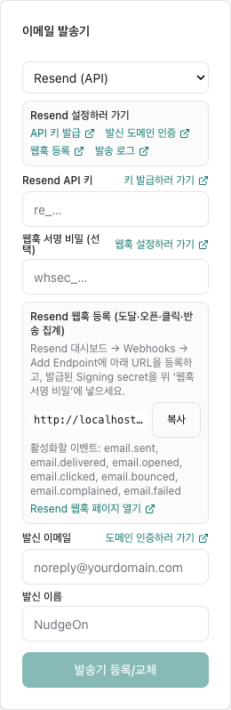
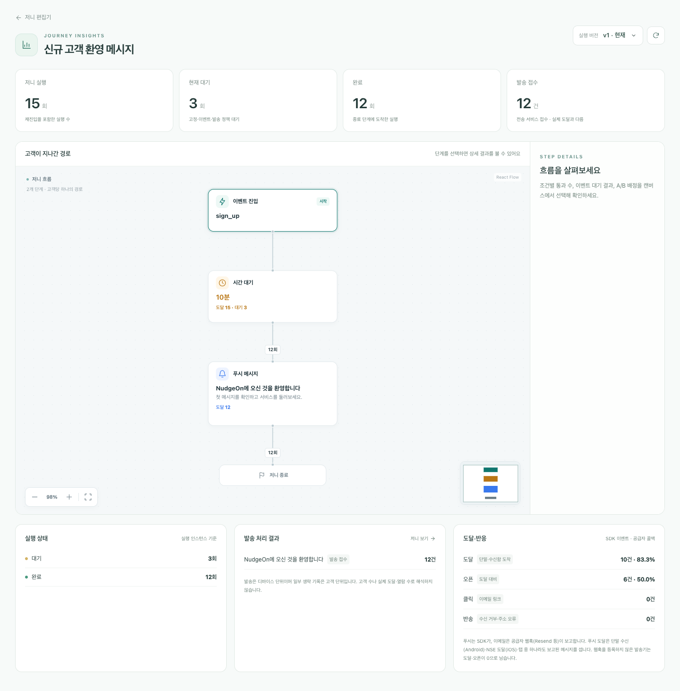
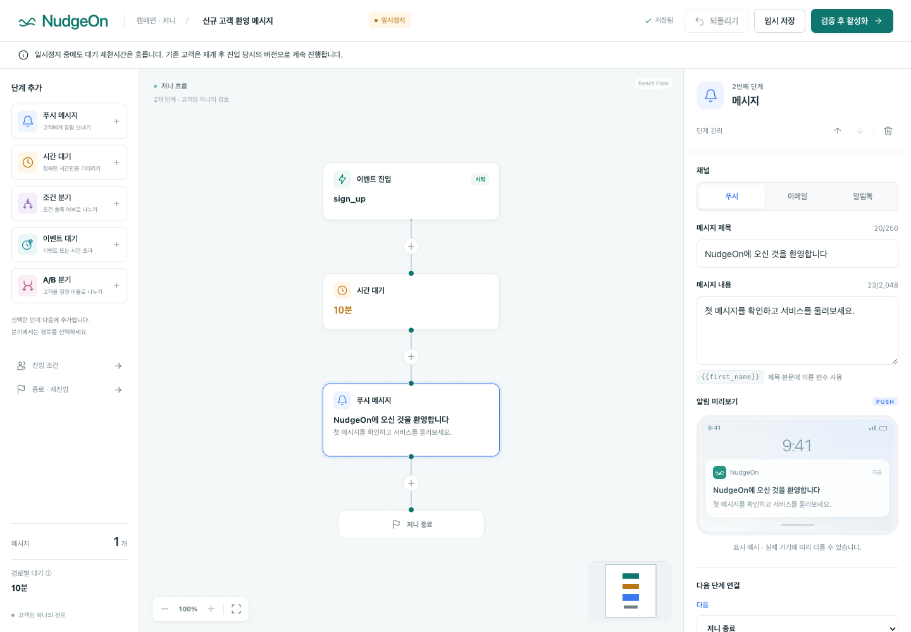

# Resend로 이메일 보내기

NudgeOn는 Resend를 **두 가지 방식**으로 지원합니다. 둘 다 콘솔의 `이메일 템플릿 > 이메일 발송기` 또는 온보딩 2단계에서 등록합니다.

| | Resend (SMTP) | Resend (API) |
|---|---|---|
| 등록 정보 | API 키 하나 | API 키 + 웹훅 서명 비밀 |
| 발송 | 표준 SMTP 릴레이 | Resend HTTP API |
| 크리덴셜 검증 | SMTP 연결·인증 | API 키 + **발신 도메인 인증 상태** 확인 |
| 도달·오픈·클릭 리포트 | ❌ (발송 접수까지만) | ✅ 웹훅으로 수집 |
| 반송·수신거부 기록 | ❌ | ✅ |
| 언제 쓰나 | 지금 당장 보내보고 싶을 때 | 성과를 측정할 때 (권장) |

콘솔의 발송기 카드에는 **Resend 설정하러 가기** 패널이 있어 API 키·도메인·웹훅·발송 로그 페이지로 바로 이동합니다.



---

## 1. 준비 — Resend 쪽에서 먼저 할 일

1. **발신 도메인 인증**: [resend.com/domains](https://resend.com/domains)에서 도메인을 추가하고 DNS 레코드를 등록해 상태가 `verified`가 되게 합니다. NudgeOn는 크리덴셜 검증 때 이 상태를 확인하므로, 인증 전에는 등록이 실패합니다.
2. **API 키 발급**: [resend.com/api-keys](https://resend.com/api-keys)에서 발급합니다. 발송만 할 것이면 `Sending access`로 충분하지만, **NudgeOn의 도메인 검증에는 도메인 조회 권한이 필요**하므로 `Full access` 키를 권장합니다.

## 2. Resend (SMTP) — 가장 빠른 길

콘솔에서 발송기 `Resend (SMTP)`를 고르고 **비밀번호 칸에 Resend API 키**를 넣은 뒤 발신 이메일·이름을 입력하면 끝입니다. 호스트·포트·사용자명은 아래 값으로 고정됩니다.

```
host: smtp.resend.com
port: 465 (implicit TLS)
username: resend
password: <Resend API Key>
```

이 방식은 `email_smtp` 크리덴셜로 저장되므로 기존 SMTP 발송 경로를 그대로 씁니다. 다만 SMTP에는 결과 콜백이 없어 **발송 접수까지만** 알 수 있습니다.

## 3. Resend (API) — 도달·오픈·클릭까지

### 3.1 크리덴셜 등록

발송기 `Resend (API)`를 고르고 API 키와 발신 이메일을 입력합니다. 저장하면 워커가 몇 초 안에 검증합니다.

- **검증 완료**: API 키가 유효하고 발신 도메인이 `verified` 상태입니다.
- **검증 실패**: 카드에 사유가 그대로 표시되고 `도메인 상태 확인하러 가기` 링크가 함께 나옵니다.

| 표시되는 사유 | 원인과 조치 |
|---|---|
| `Resend 인증 실패(400) validation_error: API key is invalid` | 키가 잘못됐거나 폐기됨. 새 키 발급 |
| `발신 도메인 미인증(status=pending)` | DNS 레코드 미반영. Resend 도메인 화면에서 상태 확인 |
| `발신 도메인이 Resend에 등록되지 않음` | 발신 이메일의 도메인을 Resend에 추가 |
| `Resend 인증 실패(403) restricted_api_key` | 키 권한 부족. Full access 키로 교체 |

> Resend는 잘못된 API 키에 401이 아니라 **HTTP 400 + `"API key is invalid"`** 를 반환합니다. NudgeOn는 4xx 응답 메시지가 키·권한을 가리키면 인증 실패로 분류해 크리덴셜을 `error`로 표시합니다.

### 3.2 웹훅 등록 — 이게 있어야 도달·오픈이 채워집니다

콘솔 발송기 카드가 등록할 URL을 보여줍니다. 복사해서 [resend.com/webhooks](https://resend.com/webhooks) → `Add Endpoint`에 붙여넣으세요.

```
POST {API 주소}/v1/webhooks/resend/{app_id}
```

활성화할 이벤트 7개:

```
email.sent  email.delivered  email.opened  email.clicked
email.bounced  email.complained  email.failed
```

등록하면 Resend가 **Signing secret**(`whsec_…`)을 발급합니다. 이 값을 콘솔의 `웹훅 서명 비밀`에 넣고 다시 저장하세요. NudgeOn는 Svix 서명 규약으로 모든 요청을 검증하며, 서명이 없거나 타임스탬프가 5분을 벗어나면 401로 거절합니다.

### 3.3 결과 확인

저니 리포트의 **도달·반응** 패널에서 확인합니다.



| 지표 | 어디서 오나 |
|---|---|
| 도달 | 푸시는 SDK `$push_delivered`, 이메일은 `email.delivered` 웹훅 |
| 오픈 | 푸시는 SDK `$push_opened`, 이메일은 `email.opened` 웹훅 |
| 클릭 | `email.clicked` 웹훅 (링크 주소 함께 기록) |
| 반송 | `email.bounced`·`email.complained` 웹훅 |

웹훅을 등록하지 않은 발송기(SMTP·NHN)는 도달·오픈이 0으로 남습니다. 발송 접수 건수는 `발송 처리 결과` 패널에서 따로 봅니다.

---

## 4. 저니에서 Resend 지정하기

저니의 이메일 노드에서 `발송기`를 `Resend`로 지정하면 그 노드만 Resend로 나갑니다. `자동(활성 발송기)`으로 두면 최근 검증된 발송기가 쓰입니다. 여러 발송기를 동시에 등록해 두고 노드별로 나눠 쓸 수 있습니다.



---

## 5. 내부 동작 (참고)

```
저니/캠페인 ──▶ stream:send.email ──▶ 채널 워커 ──▶ Resend API
                                          │            │
                          message_log에 provider_message_id 기록
                                                       ▼
Resend 웹훅 ──▶ POST /v1/webhooks/resend/{appId} (Svix 서명 검증)
             ──▶ stream:message.lifecycle (message.lifecycle.v1)
             ──▶ ClickHouse message_lifecycle ──▶ 도달·반응 리포트
```

- 발송 시 `Idempotency-Key`에 NudgeOn의 `message_id`를 실어 중복 발송을 막습니다.
- 같은 값을 `nudgeon_message_id` 태그와 `X-NudgeOn-Message-Id` 헤더로도 보내, 웹훅이 어느 발송의 결과인지 조인합니다. 태그가 없으면 Resend의 `email_id`를 `message_log.provider_message_id`와 대조합니다.
- 계약 정의는 [커넥터 계약 문서](CONNECTOR-CONTRACT.md)와 `packages/queue-schemas/schemas/message.lifecycle.v1.schema.json`에 있습니다.

## 6. 오류 분류

발송 실패는 아래 기준으로 나뉘고, 재시도 여부가 달라집니다.

| Resend 응답 | NudgeOn 분류 | 동작 |
|---|---|---|
| 401 / 403, 또는 4xx 중 키·권한 관련 메시지 | `credential_auth` | 크리덴셜 `error` 전환 |
| 429 | `rate_limited` | `Retry-After` 만큼 대기 후 재시도 |
| 400 / 422 중 수신자 관련 | `invalid_target` | 재시도 없음, 폴백 대상 |
| 400 / 422 그 외 | `permanent_content` | 재시도 없음 |
| 5xx · 네트워크 오류 | `retryable` | 지수 백오프 재시도 |
